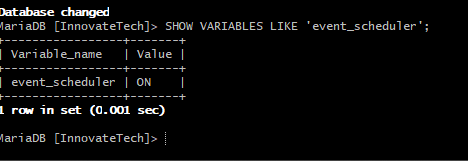
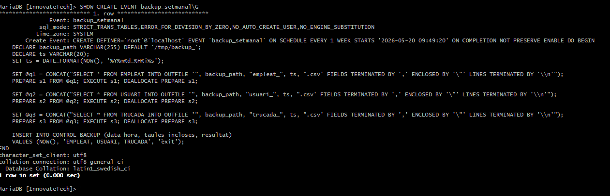

# Backup i Event Scheduler

Aquest document mostra les captures relacionades amb l'activació i la supervisió del planificador d'esdeveniments de MariaDB per al backup setmanal.

## Activació del planificador d'events

El servei `event_scheduler` ha d'estar activat perquè els events automàtics funcionin.

```sql
SHOW VARIABLES LIKE 'event_scheduler';
```

Resultat esperat: `Value = ON`.



## Definició de l'event `backup_setmanal`

L'event `backup_setmanal` genera còpies de seguretat periòdiques del sistema. La següent captura mostra la creació o la definició de l'event.

```sql
SHOW CREATE EVENT backup_setmanal\G
```



## Notes

- `event_scheduler` ha d'estar actiu en la sessió global perquè MariaDB executi els events.
- El backup setmanal ha de generar els fitxers de sortida en un directori segur.
