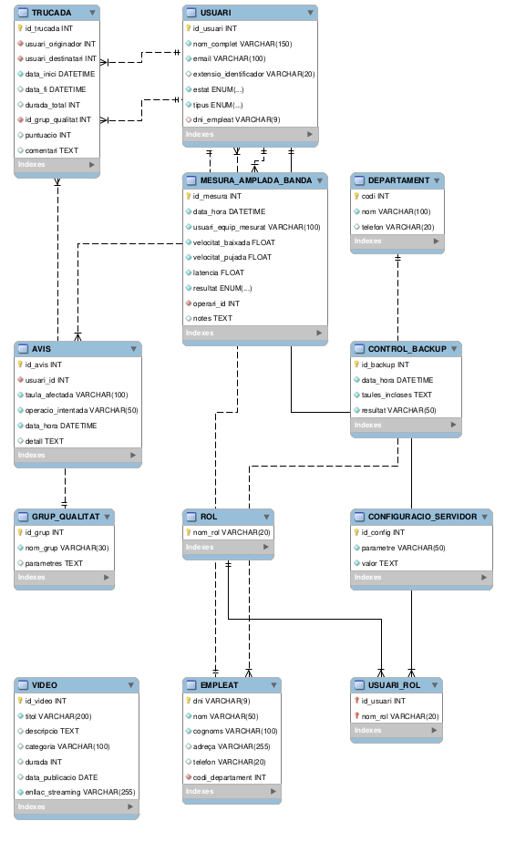

# Model Entitat-Relació

## Introduccio

El següent model Entitat-Relació representa l'estructura de dades necessària per gestionar el sistema de comunicació interna d'InnovateTech. La base de dades emmagatzema informació sobre:

- Personal i organització: empleats i departaments.
- Comunicació: usuaris (interns i externs), trucades i configuració de qualitat.
- Streaming: catàleg de vídeos disponibles.
- Monitorització: proves d'amplada de banda realitzades pels operaris.
- Seguretat i auditoria: rols d'usuaris, control d'accés i registre d'avisos.

El model s'ha dissenyat seguint els requisits de l'apartat 3.2 i 3.3 de l'enunciat del projecte.

## Com hem creat el diagrama E/R (resum del procés)

### 1. Extracció de requisits

Vam llegir l’enunciat (apartats 3.2 i 3.3) i vam identificar 12 entitats amb els seus atributs, claus primàries i obligatorietat (NOT NULL). També vam detectar totes les relacions i els seus tipus (1:N, N:M, 0..1:1).

### 2. Disseny lògic

Vam dibuixar un esborrany inicial on vam:

- Assignar PK a cada entitat (codi, dni, id_usuari, nom_rol, etc.)
- Definir FK per a cada relació (p. ex., codi_departament a EMPLEAT)
- Resoldre la relació N:M entre USUARI i ROL mitjançant la taula associativa USUARI_ROL
- Establir cardinalitats explícites (ex: EMPLEAT → DEPARTAMENT és N:1; USUARI → EMPLEAT és 0..1:1)

### 3. Implementació al SGBD (MySQL)

Vam escriure un script SQL que crea totes les taules amb:

- PRIMARY KEY, FOREIGN KEY
- NOT NULL als atributs obligatoris
- UNIQUE a l’email d’usuari i al nom de departament
- CHECK per a valors (puntuació entre 1 i 5, durada >=0, etc.)
- Dades de prova significatives

### 4. Generació automàtica del diagrama

Vam executar l’script a la base de dades local i després vam fer servir l’eina Reverse Engineer del MySQL Workbench. Aquesta va llegir l’esquema i va dibuixar automàticament les taules, atributs i cla

### 5. Ajust manual i exportació

Vam reorganitzar les taules perquè fossin llegibles, vam verificar les cardinalitats (especialment la relació opcional USUARI-EMPLEAT) i vam exportar el diagrama 

|  |
| :---: |
| Diagrama Entitat Relacio |