# Documentació completa del projecte InnovateTech CPD

---

## Índex

| # | Mòdul | Contingut |
|---|---|---|
| 01 | [CPD Físic](#01-cpd-físic) | Infraestructura elèctrica, IT, RRLL, seguretat, ubicació |
| 02 | [AWS](#02-aws) | Ansible, LDAP, Graylog, usuaris, Web + SFTP |
| 03 | [Àudio](#03-àudio) | Servei de streaming d'àudio (Icecast2) |
| 04 | [Vídeo](#04-vídeo) | Servei de streaming de vídeo (NGINX-RTMP + HLS) |
| 05 | [Videoconferència](#05-videoconferència) | Protocol WebRTC i Jitsi Meet |
| 06 | [Amplada de banda](#06-amplada-de-banda) | Mesura de xarxa contra el servidor de streaming |
| 07 | [Base de dades](#07-base-de-dades) | Diagrama E/R, model relacional, rols, triggers, backups |
| 08 | [1665](#08-1665) | Optimització, seguretat de dades, transformació digital |
| 09 | [App Web](#09-app-web) | Panel de gestió CPD — `index.php` (PHP + CSS + JS) |

### Detall de seccions

**01 — CPD Físic**
- [1.1 Infraestructura elèctrica](01-cpd-fisic/1.1-infraestructura-electrica.md)
- [1.2 Infraestructura IT](01-cpd-fisic/1.2-infraestructura-it.md)
- [1.3 Prevenció de riscos laborals](01-cpd-fisic/1.3-prevencio-rrll.md)
- [1.4 Seguretat física i lògica](01-cpd-fisic/1.4-seguretat-fisica-logica.md)
- [1.5 Ubicació física](01-cpd-fisic/1.5-ubicacio.md)

**02 — AWS**
- [2.1 Gestió amb Ansible](02-aws/ansible.md)
- [2.2 Servei de logs (Graylog)](02-aws/servei-logs-graylog.md)
- [2.3 LDAP](02-aws/ldap.md)
- [2.4 Usuaris administradors](02-aws/usuaris-admin.md)
- [2.5 Web + SFTP](02-aws/web-sftp.md)

**03 — Àudio**
- [3.1 Descripció del servei d'àudio](03-audio/Descripció_de_la_funcionalitat_Audio.md)

**04 — Vídeo**
- [4.1 Descripció del servei de vídeo](04-video/Descripció_de_la_funcionalitat_Servei_de_Vídeo.md)

**05 — Videoconferència**
- [5.1 Protocol WebRTC](05-videoconferencia/Descripció_Protocol_WebRTC.md)

**06 — Amplada de banda**
- 6.1 Mesura d'amplada de banda → [vegeu secció 09](#06-amplada-de-banda)

**07 — Base de dades**
- [7.1 Backup i event](07-bd/backup-event.md)
- [7.2 Diagrama E/R](07-bd/er-diagrama.md)
- [7.3 Model relacional](07-bd/model-relacional.md)
- [7.4 Rols i permisos](07-bd/rols-permisos.md)
- [7.5 Triggers](07-bd/triggers.md)

**08 — 1665**
- *Pendent de documentar*

**09 — App Web**
- [9.1 Panel de gestió CPD (`index.php`)](#91-webindexphp--panel-de-gestió-cpd)

---

## Captures (carpeta `capturas/`)

La carpeta `capturas/` conté imatges organitzades per temàtiques com a suport visual de la documentació.

### 01-cpd-fisic
- `capturas/01-cpd-fisic/CPD-LOGICA.svg` — Diagrama lògic del CPD.
- `capturas/01-cpd-fisic/VISTAISOMETRICA.svg` — Vista isomètrica del CPD.
- `capturas/01-cpd-fisic/VISTA2D.svg` — Vista 2D del CPD.
- `capturas/01-cpd-fisic/LOGICA-SAIS.svg` — Diagrama de l'alimentació i dels SAIs.
- `capturas/01-cpd-fisic/infraestructura-it.png` — Esquema d'infraestructura IT i distribució dels racks.
- `capturas/01-cpd-fisic/RED.png` — Topologia de xarxa del CPD.

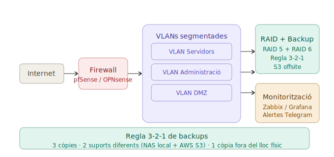

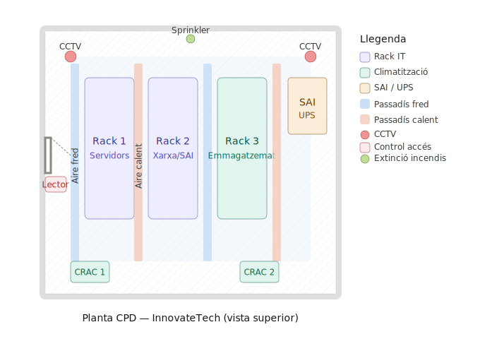
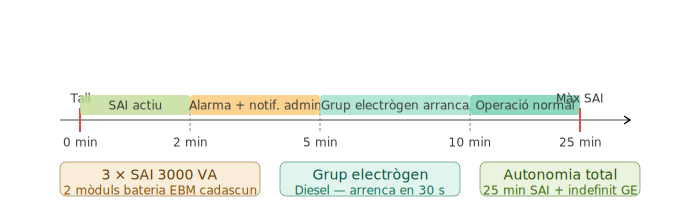
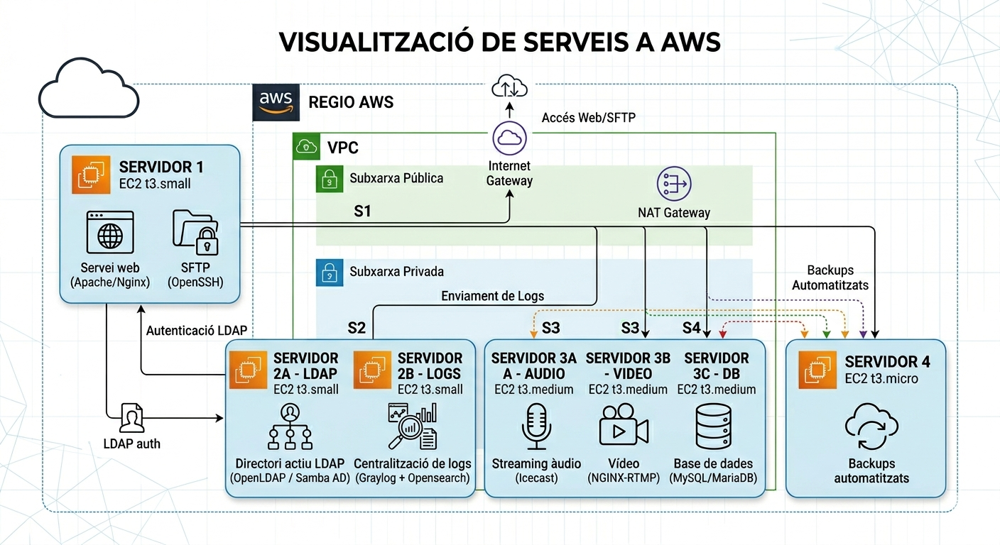
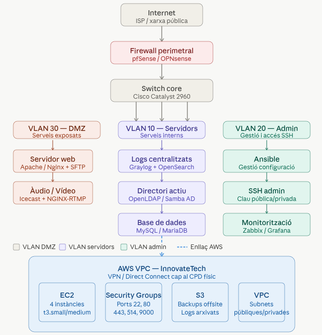

Referència: [01-cpd-fisic](01-cpd-fisic)

### 07-bd
- `capturas/07-bd/er-diagrama/RAPJ-SQL.png` — Diagrama de la base de dades SQL.
- `capturas/07-bd/er-diagrama/RAPJ-E-R.png` — Diagrama entitat-relació.

Referència: [07-bd](07-bd)

### Altres carpetes
- `capturas/03-audio/README.md`
- `capturas/04-video/README.md`
- `capturas/05-videoconferencia/README.md`
- `capturas/06-amplada-banda/README.md`
- `capturas/08-1665/README.md`

Aquestes carpetes estan presents però no contenen imatges addicionals per a la documentación actual.

---

## 01. CPD Físic

### 1.1 01-cpd-fisic/1.1-infraestructura-electrica.md

# 1.1 Infraestructura elèctrica

## Objectiu i criteris de disseny

L'infraestructura elèctrica del CPD està dissenyada per garantir la disponibilitat dels serveis crítics, la protecció dels equips i la seguretat del personal. Els criteris principals són:

- Redundància de subministrament.
- Segregació de càrregues per rack.
- Capacitat d'autonomia per a transicions ordenades.
- Supervisió i manteniment periòdics.

## Subministrament i redundància

El CPD rep alimentació de dues línies independents (Línia A i Línia B) i compta amb un generador de dièsel de reserva. Cada línia es distribueix de forma separada fins als quadres de protecció per minimitzar el risc de tall simultani.

```
Xarxa elèctrica
      │
   ┌──┴──┐
Línia A  Línia B
   │        │
   └──┬─────┘
      │
  ATS/Distribució
      │
  ┌──┴────┬────┐
 [SAI1] [SAI2] [SAI3]
   │       │      │
 Rack1  Rack2  Rack3
      │       │      │
   [Generador dièsel]
```

## Distribució de càrrega

Les càrregues es separen en tres blocs per garantir disponibilitat i flexibilitat:

- **Rack 1**: servidors d'aplicacions i serveis.
- **Rack 2**: equipament de xarxa i gestió.
- **Rack 3**: emmagatzematge i còpies de seguretat.

Aquesta segregació facilita el manteniment i limita l'impacte de fallades a un únic domini.

## Càlcul de la càrrega i dimensionament

| Equip | Unitats | W/unitat | Total W |
|---|---|---|---|
| Servidors (5 unitats) | 5 | 300 W | 1.500 W |
| Switches (core + accés) | 2 | 80 W | 160 W |
| NAS primari + secundari | 2 | 120 W | 240 W |
| KVM + patch panels | 1 | 30 W | 30 W |
| Unitats CRAC (climatització) | 2 | 400 W | 800 W |
| **Subtotal** | | | **2.730 W** |
| **Marge de seguretat +20 %** | | | **+546 W** |
| **Càrrega total estimada** | | | **≈ 3.280 W** |

Aquest dimensionament incorpora un marge per a futurs creixements i per a desviacions del consum estimat.

Aquestes xifres es basen en una estimació inicial d'ús per part de la infraestructura del CPD:

- 100–150 usuaris finals simultanis a serveis web i SFTP.
- 10–15 administradors i personal de gestió de TI.
- 20 connexions internes de serveis per a LDAP, monitoratge i replicació.

Aquestes previsions ajuden a verificar que els SAIs, el generador i la distribució elèctrica són suficients per mantenir el funcionament amb marge de seguretat.

## Selecció i instal·lació dels SAIs

S'instal·len **3 SAIs de 3.000 VA / 2.700 W**, un per rack:

| SAI | Rack | Càrrega protegida | Mòduls EBM |
|---|---|---|---|
| SAI 1 | Rack 1 — Servidors | Servidors 1–5 | 2 mòduls |
| SAI 2 | Rack 2 — Xarxa | Switches, firewall, KVM | 2 mòduls |
| SAI 3 | Rack 3 — Emmagatzematge | NAS primari i secundari | 1 mòdul |

Això assegura protecció dedicada i facilita la prova i substitució de cada unitat.

## Autonomia i transició a generador

| Fase | Temps | Acció |
|---|---|---|
| 0 min | Tall elèctric | Els SAIs proveeixen alimentació immediata |
| 0–2 min | Estabilització | Tensió estabilitzada i alarma enviada |
| 2–5 min | Arrencada generador | Generador ences o automàtic |
| 5–10 min | Commutació | ATS commuta a generador estable |
| 10–30 min | Operació normal | Funcionament amb generador |
| > 30 min | Apagat ordenat | Si el generador no està disponible |

> La prioritat és mantenir les càrregues crítiques mentre es controla la resta de sistemes.

## Grup electrogen

- **Combustible**: dièsel.
- **Temps d'arrencada**: < 30 segons.
- **Autonomia**: 48–72 h amb el dipòsit ple.
- **Commutació**: ATS automàtica.
- **Proves**: arrencades mensuals per verificar estat.

## Supervisió i manteniment

- Monitoratge de tensió, corrent i estat de bateria.
- Revisió periòdica dels quadres i proteccions.
- Mesura de temperatura i humitat al voltant dels SAIs i generador.
- Inspecció anual del cablejat i connexions.

### 1.2 01-cpd-fisic/1.2-infraestructura-it.md

# 1.2 Infraestructura IT

## Objectiu i arquitectures

Aquesta secció descriu com s'organitzen els serveis del CPD, la xarxa de comunicacions i la infraestructura física de suport per garantir la disponibilitat, la seguretat i la gestió centralitzada.

## Serveis i separació de funcions

La infraestructura IT es distribueix en servidors amb funcions específiques per evitar interferències entre serveis i permetre una gestió més clara.

| Servidor | Funció principal | Equivalent AWS |
|---|---|---|
| Servidor 1 | LDAP + SFTP — OpenLDAP, OpenSSH (SSSD integrat) | EC2 t3.small |
| Servidor 2 | Web — Nginx + PHP-FPM | EC2 t3.small |
| Servidor 3 | Streaming àudio — Icecast2 | EC2 t3.small |
| Servidor 4 | Streaming vídeo — NGINX-RTMP + HLS | EC2 t3.medium |
| Servidor 5 | Base de dades — MariaDB | EC2 t3.medium |
Aquesta separació facilita l'escalabilitat i minimitza l'impacte de fallades de servei.

## Càrrega de serveis i usuaris

Aquest disseny es basa en una estimació d'ús orientada a 100–150 usuaris finals actius simultanis i els següents patrons de servei:

- **Servei web i SFTP**: fins a 100 connexions concorrents, amb una base de 200–300 usuaris registrats per dia, gestió de fitxers i descàrregues de contingut.
- **LDAP i logs**: 50 consultes d'autenticació per minut i 10 serveis interns enviant logs en temps real.
- **Streaming d'àudio i vídeo**: 20 fluxos simultanis de reproducció, 50 oients/visualitzadors concorrents i 50 connexions a la base de dades.
- **Backups**: 4 treballs programats per nit amb transferència de 150–200 GB diaris.

Aquesta quantificació justifica l'ús d'instàncies EC2 de tipus t3.small per als serveis lleugers (LDAP+SFTP, web, àudio) i t3.medium per a les càrregues més exigents (vídeo i base de dades).

## Gestió centralitzada amb Ansible

L'automatització amb **Ansible** aporta:

- Configuració reproductible dels equips.
- Desplegaments consistents i controlats.
- Menor necessitat d'accés manual per SSH a cada host.
- Documentació de playbooks i inventaris.

### Administració dels servidors

- Ús d'un **usuari no-root** dedicat per a gestió.
- Autenticació amb **clau pública/privada SSH**.
- Màquina de control Ansible separada dels hosts gestionats.
- Inventari estructurat per rols i grups.

## Xarxa i segmentació

La xarxa es segmenta per controlar l'accés i disminuir els riscos:

| VLAN | Nom | Ús | Ports/serveis |
|---|---|---|---|
| VLAN 10 | Servidors | Comunicacions internes | Ports de serveis interns |
| VLAN 20 | Administració | Accés SSH i gestió | SSH, SNMP, monitoratge |
| VLAN 30 | DMZ | Serveis públics | HTTP/HTTPS, RTMP, SFTP |

## Components de xarxa i cablejat

### Switches

| Dispositiu | Ubicació | Funció |
|---|---|---|
| Switch core | Rack 2 | Distribució de trànsit entre racks i VLANs |
| Switch d'accés | Rack 2 | Connexió de servidors i NAS |

### Patch panels

- **2 patch panels Cat6A de 24 ports** a Rack 1.
- **1 patch panel de fibra òptica** a Rack 3.
- Etiquetatge bidireccional per manteniment ràpid.

### Connexions entre racks

- **Rack 1 ↔ Rack 2**: Cat6A des del patch panel de Rack 1 al switch core de Rack 2.
- **Rack 2 ↔ Rack 3**: Cat6A del switch d'accés als NAS.
- **Tots els racks**: fibra òptica per a trànsit d'alta capacitat.

## Disponibilitat i manteniment

- Configuració física separada per facilitar l'actualització d'un rack sense impactar els altres.
- Monitoratge de rendiment i condicions ambientals.
- Revisions periòdiques del cablejat i de l'equipament de xarxa.

---

## Especificacions físiques dels equips

Aquesta secció detalla l'equipament físic seleccionat per al CPD, amb les especificacions tècniques de cada dispositiu i la justificació de l'elecció en funció de la càrrega de servei documentada (100–150 usuaris finals simultanis, 5 serveis principals independents).

---

### Servidors

#### Servidor 1 — LDAP + SFTP
**Model: Dell PowerEdge R250 (1U)**

| Component | Especificació |
|---|---|
| CPU | Intel Xeon E-2334 (4 nuclis / 8 fils, 3,4 GHz base / 4,8 GHz turbo) |
| RAM | 16 GB DDR4 ECC 3200 MHz (2 ranures lliures per a expansió) |
| Emmagatzematge | 2× 960 GB SSD SATA 2,5" Hot-plug (RAID 1) |
| Xarxa | 2× NIC 1 GbE integrades (Intel i350) |
| Alimentació | PSU simple 450 W (80 PLUS Bronze) |
| Factor de forma | 1U Rack |
| Consum estimat | ~110 W en càrrega típica |

**Justificació:** LDAP i SFTP s'allotgen al mateix servidor perquè el servei SFTP s'autentica directament contra OpenLDAP via SSSD: tenir-los en la mateixa màquina elimina la latència de xarxa en cada verificació de credencials i simplifica la gestió de permisos. OpenLDAP és molt lleuger (50 consultes/min no superen uns pocs MB de RAM ni el 5% de CPU), de manera que el Dell PowerEdge R250, el servidor d'entrada 1U de Dell, és més que suficient per als dos serveis combinats. Els 16 GB ECC garanteixen estabilitat en operació 24/7, els SSD de 960 GB en RAID 1 proporcionen espai adequat per als directoris home dels 4 usuaris SFTP i creixement futur, i les 2 NICs 1 GbE son suficients per a les transferències de fitxers i les consultes de directori en xarxa interna.

---

#### Servidor 2 — Web (Nginx + PHP-FPM)
**Model: Dell PowerEdge R250 (1U)**

| Component | Especificació |
|---|---|
| CPU | Intel Xeon E-2334 (4 nuclis / 8 fils, 3,4 GHz base / 4,8 GHz turbo) |
| RAM | 16 GB DDR4 ECC 3200 MHz (2 ranures lliures per a expansió) |
| Emmagatzematge | 2× 480 GB SSD SATA 2,5" Hot-plug (RAID 1) |
| Xarxa | 2× NIC 1 GbE integrades (Intel i350) |
| Alimentació | PSU simple 450 W (80 PLUS Bronze) |
| Factor de forma | 1U Rack |
| Consum estimat | ~100 W en càrrega típica |

**Justificació:** El servidor web executa Nginx + PHP-FPM per servir el panell d'administració (`index.php`) a fins a 100 connexions concurrents. Nginx és un servidor web molt eficient en memòria (els workers comparteixen recursos), i PHP-FPM amb 100 workers paral·lels consumeix aproximadament 3–4 GB de RAM, molt per sota dels 16 GB disponibles. El Xeon E-2334 amb 8 fils gestiona les sol·licituds paral·leles sense cues. S'utilitza el mateix model que el Servidor 1 (Dell PowerEdge R250) per reduir l'inventari de peces de recanvi i facilitar la gestió, ja que ambdós servidors tenen perfils de càrrega equivalents. Els SSD de 480 GB en RAID 1 són suficients per als fitxers de l'aplicació web i els logs de Nginx.

---

#### Servidor 3 — Streaming Àudio (Icecast2)
**Model: Dell PowerEdge R250 (1U)**

| Component | Especificació |
|---|---|
| CPU | Intel Xeon E-2314 (4 nuclis / 4 fils, 2,8 GHz base / 4,5 GHz turbo) |
| RAM | 8 GB DDR4 ECC 3200 MHz (expandible) |
| Emmagatzematge | 2× 480 GB SSD SATA 2,5" Hot-plug (RAID 1) |
| Xarxa | 2× NIC 1 GbE integrades (Intel i350) |
| Alimentació | PSU simple 450 W (80 PLUS Bronze) |
| Factor de forma | 1U Rack |
| Consum estimat | ~80 W en càrrega típica |

**Justificació:** Icecast2 és un servei de relay d'àudio: rep un únic flux del broadcaster i el distribueix als oients sense transcodificar. El consum de CPU és mínim (< 5% per a 50 oients simultanis) i la RAM que ocupa és d'uns 100–200 MB en operació. El consum de xarxa de 50 oients a 320 Kbps representa ~16 Mbps, una fracció de la capacitat d'una NIC 1 GbE (1000 Mbps). Per aquests motius, el Dell PowerEdge R250 amb el Xeon E-2314 (versió de 4 fils, més econòmica) és l'elecció correcta: no té sentit dimensionar més un servei que mai superarà el 10% dels recursos del servidor. El pressupost estalviat aquí es pot invertir en el servidor de vídeo, que sí requereix maquinari més potent.

---

#### Servidor 4 — Streaming Vídeo (NGINX-RTMP + HLS)
**Model: Dell PowerEdge R350 (1U)**

| Component | Especificació |
|---|---|
| CPU | Intel Xeon E-2378 (8 nuclis / 16 fils, 2,6 GHz base / 4,8 GHz turbo) |
| RAM | 32 GB DDR4 ECC 3200 MHz (2× 16 GB) |
| Emmagatzematge | 2× 960 GB SSD SATA 2,5" Hot-plug (RAID 1) |
| Xarxa | 2× NIC 10 GbE (Intel X550-T2, PCIe) |
| Alimentació | PSU doble redundant 700 W (80 PLUS Gold) |
| Factor de forma | 1U Rack |
| Consum estimat | ~180 W en càrrega típica |

**Justificació:** El servidor de vídeo és el que requereix maquinari més potent de tot el CPD. NGINX-RTMP rep el flux de l'emissor i el mòdul HLS el divideix en segments `.ts` que escriu contínuament a disc: 20 fluxos simultanis a 4 Mbps cadascun representen ~80 Mbps de trànsit de sortida, i amb 50 visualitzadors el pic pot arribar a ~200 Mbps, una xifra que saturaria completament una NIC de 1 GbE. Per això les NICs 10 GbE (Intel X550-T2) són imprescindibles. El Xeon E-2378 amb 8 nuclis gestiona la generació paral·lela de segments HLS i les connexions RTMP entrants sense bloquejos. Els 32 GB de RAM permeten mantenir els segments actius en memòria (buffer) per servir-los ràpidament. Els SSD de 960 GB emmagatzemen els segments HLS temporals i el contingut VOD. La PSU redundant protegeix el servei de vídeo, que és el més crític per a l'experiència de l'usuari, davant de qualsevol fallada elèctrica.

---

#### Servidor 5 — Base de dades (MariaDB)
**Model: Dell PowerEdge R350 (1U)**

| Component | Especificació |
|---|---|
| CPU | Intel Xeon E-2378 (8 nuclis / 16 fils, 2,6 GHz base / 4,8 GHz turbo) |
| RAM | 32 GB DDR4 ECC 3200 MHz (2× 16 GB) |
| Emmagatzematge | 2× 960 GB SSD SATA 2,5" Hot-plug (RAID 1) |
| Xarxa | 2× NIC 1 GbE integrades (Intel i350) |
| Alimentació | PSU doble redundant 700 W (80 PLUS Gold) |
| Factor de forma | 1U Rack |
| Consum estimat | ~160 W en càrrega típica |

**Justificació:** MariaDB és el servei que rep connexions de múltiples servidors alhora: l'aplicació web, el servidor de streaming i els backups nocturns accedeixen simultàniament a les 12 taules de la base de dades InnovateTech. El rendiment d'un servidor de bases de dades depèn principalment de dues coses: la RAM (per al buffer pool d'InnoDB, que ha de ser el 50–70% de la RAM total per evitar lectures de disc) i la velocitat de disc (per a les escriptures de transaccions i el log binari). Amb 32 GB, s'assignen 20 GB al buffer pool d'InnoDB, mantenint totes les taules actives en memòria i eliminant pràcticament els accesos a disc en lectura. El Xeon E-2378 amb 16 fils gestiona les 50 connexions concurrents documentades sense esperes. S'utilitza el mateix model que el Servidor 4 (R350) per unificar peces de recanvi i facilitar la substitució en cas d'avaria. La PSU redundant protegeix la integritat de les transaccions en curs.

---

### Dispositius d'emmagatzematge NAS

#### NAS Primari — RAID 5
**Model: Synology RS1221+ (2U Rack)**

| Component | Especificació |
|---|---|
| CPU | AMD Ryzen V1500B (4 nuclis, 2,2 GHz) |
| RAM | 8 GB DDR4 ECC (expandible fins a 32 GB) |
| Bahies | 8× 3,5" SATA Hot-swap |
| Discos instal·lats | 4× Seagate IronWolf Pro 8 TB SATA (ST8000NT001) |
| Configuració RAID | RAID 5 → **24 TB útils** (1 disc de tolerància) |
| Interfícies | 4× NIC 1 GbE + 2× ranures PCIe per a expansió 10 GbE |
| Factor de forma | 2U Rack |
| Consum estimat | ~50 W en càrrega típica |

**Justificació:** El Synology RS1221+ és un NAS de format rack pensat per a entorns empresarials amb alta disponibilitat. La CPU AMD Ryzen V1500B gestiona eficientment les operacions de lectura/escriptura paral·leles dels 4 treballs de backup nocturns sense crear cues. La memòria ECC prevé la corrupció silenciosa de dades (bit rot), especialment rellevant en emmagatzematge a llarg termini. Els discos Seagate IronWolf Pro estan fabricats específicament per a NAS en operació 24/7, amb una taxa de càrrega de 300 TB/any molt superior als discos de consum estàndard, i inclouen tecnologia IronWolf Health Management per monitoratge proactiu. Amb RAID 5 sobre 4 discos s'obtenen 24 TB útils, suficients per a mesos de còpies incrementals (200 GB/dia × 30 dies = ~6 TB de retenció mensual), amb marge per a les còpies setmanals completes.

---

#### NAS Secundari — RAID 6
**Model: Synology RS1221+ (2U Rack)**

| Component | Especificació |
|---|---|
| CPU | AMD Ryzen V1500B (4 nuclis, 2,2 GHz) |
| RAM | 8 GB DDR4 ECC (expandible fins a 32 GB) |
| Bahies | 8× 3,5" SATA Hot-swap |
| Discos instal·lats | 6× Seagate IronWolf Pro 8 TB SATA (ST8000NT001) |
| Configuració RAID | RAID 6 → **32 TB útils** (2 discos de tolerància) |
| Interfícies | 4× NIC 1 GbE + 2× ranures PCIe per a expansió 10 GbE |
| Factor de forma | 2U Rack |
| Consum estimat | ~60 W en càrrega típica |

**Justificació:** S'utilitza la mateixa plataforma que el NAS primari per simplificar la gestió, les peces de recanvi i la configuració de replicació automàtica (Synology Hyper Backup pot replicar directament entre dos RS1221+). RAID 6 amb 6 discos ofereix tolerància a 2 fallades de disc simultànies, molt superior al RAID 5 del NAS primari, cosa essencial per a la còpia secundària on la pèrdua de dades seria catastròfica. La capacitat útil de 32 TB (8 TB × 6 − 2 discos de paritat) permet emmagatzemar còpies de retenció més llarga que el primari. Les ranures PCIe permeten afegir una tarja 10 GbE en el futur si el creixement del volum de backups ho requereix.

---

### Commutadors de xarxa

#### Switch Core
**Model: Cisco Catalyst 1000-24T-4G-L**

| Component | Especificació |
|---|---|
| Ports d'accés | 24× GbE RJ45 |
| Uplinks | 4× SFP 1G (fibra o coure) |
| Capacitat de commutació | 56 Gbps |
| Taxa de reenviament | 41,67 Mpps |
| VLANs | Fins a 4094 (IEEE 802.1Q) |
| Funcionalitats | QoS (4 cues), STP/RSTP, SNMP v1/v2c/v3, SSH v2, ACLs, IGMP Snooping |
| Factor de forma | 1U Rack |
| Consum | ~32 W |

**Justificació:** El Cisco Catalyst 1000 és la referència del mercat per a switches gestionables en petites i mitjanes empreses. El model 24T-4G-L té ports suficients per connectar els 5 servidors, els 2 NAS, el firewall pfSense/OPNsense, el KVM i els equips d'administració, amb 4 uplinks SFP per a la fibra òptica entre racks (Rack 1 ↔ Rack 2 ↔ Rack 3). El suport de 4094 VLANs cobreix àmpliament les tres VLANs definides (VLAN 10, 20, 30). La funcionalitat QoS amb 4 cues permet prioritzar el trànsit de streaming del Servidor 3 davant del trànsit de gestió, garantint la qualitat del servei multimèdia. L'IGMP Snooping optimitza el trànsit multicast d'Icecast. La fiabilitat i l'ecosistema de suport de Cisco justifiquen l'elecció en un entorn de producció.

---

#### Switch d'Accés
**Model: Cisco Catalyst 1000-16T-2G-L**

| Component | Especificació |
|---|---|
| Ports d'accés | 16× GbE RJ45 |
| Uplinks | 2× SFP 1G |
| Capacitat de commutació | 36 Gbps |
| Taxa de reenviament | 26,79 Mpps |
| VLANs | Fins a 4094 (IEEE 802.1Q) |
| Funcionalitats | QoS, STP/RSTP, SNMP v1/v2c/v3, SSH v2, ACLs |
| Factor de forma | 1U Rack |
| Consum | ~24 W |

**Justificació:** El model d'accés de la mateixa família Cisco Catalyst 1000 garanteix compatibilitat total amb el switch core: mateixa interfície de gestió (Cisco IOS-based), mateixa sintaxi de configuració de VLANs i QoS, i actualitzacions de firmware coordinades. Les 16 portes GbE són suficients per a les connexions dels servidors del Rack 1 als NAS del Rack 3 i als ports restants del Rack 2. Els 2 uplinks SFP connecten per fibra al switch core. Usar la mateixa plataforma redueix la corba d'aprenentatge de l'administrador i simplifica el troubleshooting, ja que no cal dominar dues CLI diferents.

---

### KVM sobre IP

#### Consola de gestió centralitzada
**Model: ATEN KVM over IP CS1316 (16 ports)**

| Component | Especificació |
|---|---|
| Ports KVM | 16× RJ45 (cable adaptador KVM Cat5e/6) |
| Accés remot | Via IP (navegador web HTML5 / client Java) |
| Resolució màxima | 1920×1200 |
| Seguretat | TLS 1.2, autenticació per nivell d'usuari, registre d'accessos |
| Usuaris simultanis | 1 local + 1 remot |
| Factor de forma | 1U Rack |
| Consum | ~10 W |

**Justificació:** El KVM sobre IP ATEN CS1316 permet accedir a la consola de qualsevol dels 5 servidors de forma remota des de la VLAN d'Administració (VLAN 20), sense necessitat d'estar físicament al CPD. Això és crític per a tasques de recuperació on SSH no està disponible: restauració de BIOS/UEFI, reinstal·lació del sistema operatiu, resolució de panics del kernel o errors de configuració de xarxa que deixen el servidor inabastable. Els 16 ports permeten gestionar els 5 servidors actuals i fins a 11 equips addicionals si el CPD creix en el futur. L'accés per TLS 1.2 s'integra amb el control d'accés restringit de la VLAN 20.

---

### Resum d'equipament i ocupació de racks

| Rack | Equip | Servei | Model | U de rack |
|---|---|---|---|---|
| Rack 1 | Servidor 1 | LDAP + SFTP | Dell PowerEdge R250 | 1U |
| Rack 1 | Servidor 2 | Web (Nginx + PHP-FPM) | Dell PowerEdge R250 | 1U |
| Rack 1 | Servidor 3 | Streaming Àudio (Icecast2) | Dell PowerEdge R250 | 1U |
| Rack 1 | Servidor 4 | Streaming Vídeo (NGINX-RTMP) | Dell PowerEdge R350 | 1U |
| Rack 1 | Servidor 5 | Base de dades (MariaDB) | Dell PowerEdge R350 | 1U |
| Rack 1 | Patch Panel Cat6A #1 | — | — | 1U |
| Rack 1 | Patch Panel Cat6A #2 | — | — | 1U |
| Rack 2 | Switch Core | Distribució VLANs | Cisco Catalyst 1000-24T-4G-L | 1U |
| Rack 2 | Switch d'Accés | Connexió servidors/NAS | Cisco Catalyst 1000-16T-2G-L | 1U |
| Rack 2 | KVM sobre IP | Consola remota | ATEN CS1316 | 1U |
| Rack 2 | Patch Panel Fibra | — | — | 1U |
| Rack 3 | NAS Primari | Backups locals (RAID 5) | Synology RS1221+ | 2U |
| Rack 3 | NAS Secundari | Backups secundaris (RAID 6) | Synology RS1221+ | 2U |

> Ocupació: 7U al Rack 1, 4U al Rack 2 i 4U al Rack 3 (racks de 42U estàndard). Queda ample marge per a creixement futur en tots tres racks.

---

### 1.3 01-cpd-fisic/1.3-prevencio-rrll.md

# Prevenció de riscos laborals (RRLL)

## Objectiu

Aquesta secció defineix els riscos específics del CPD i les mesures de prevenció necessàries per garantir la seguretat del personal i la protecció dels equips.

## Metodologia d'avaluació

L'avaluació de riscos es basa en:

- Identificació dels perills.
- Anàlisi de probabilitat i impacte.
- Controls tècnics i organitzatius.
- Revisió periòdica i millora contínua.

## Riscos identificats i mesures preventives

### Risc elèctric

| Mesura | Descripció |
|---|---|
| Instal·lació certificada | Revisió per electricista autoritzat |
| Posada a terra | Racks i equips connectats a terra |
| Armari elèctric protegit | Quadres amb tancament i accés restringit |
| EPIs | Guants, calçat i ulleres de protecció |
| Senyalització | Pictogrames i etiquetatge clar |

### Risc d'incendi

| Mesura | Descripció |
|---|---|
| Sistema FM-200 / Novec | Extinció automàtica sense danyar equips |
| Detectors de fum | Sostre tècnic i sota el sòl tècnic |
| Alarma integrada | Amb la infraestructura de l'edifici |
| Vies d'evacuació | Il·luminació i accessos clars |
| Extintors CO₂ | A la porta del CPD |
| Formació | Personal format en extinció i evacuació |

### Risc ergonòmic

| Mesura | Descripció |
|---|---|
| Alçada dels racks | Equips de fàcil accés entre 0,5 i 1,7 m |
| Eines de suport | Carros elevadors i safates lliscants |
| Il·luminació | Mínim 500 lux a la zona de treball |
| Espai de pas | Passadissos mínims de 1,2 m |

### Risc ambiental

| Mesura | Descripció |
|---|---|
| Soroll | Protectors auditius per tasques llargues |
| Temperatura | 18–27 °C per als equips |
| Humitat | 40–60 % HR per evitar estàtica i condensació |
| Qualitat de l'aire | Filtratge de les unitats CRAC |

### Risc de caigudes i cops

| Mesura | Descripció |
|---|---|
| Sòl tècnic protegit | Baldoses fixades i senyalitzades |
| Il·luminació d'emergència | Activació automàtica en tall elèctric |
| Ordre i neteja | Política de zero cables al sòl |
| Control d'accés | Menys personal dins la sala |

## Procediments de seguretat

1. **Treball en parella**: qualsevol tasca de manteniment es fa amb dues persones.
2. **Permís de treball**: registre previ per accedir al CPD.
3. **Formació obligatòria**: formació en PRL, mínim 6 hores.
4. **Simulacres anuals**: evacuació i dispositius d'extinció.
5. **Botiquí**: equipat i accessible fora de la sala.
6. **Inspecció periòdica**: revisió documentada de sistemes i equips.

## Normativa de referència

- Llei 31/1995, de Prevenció de Riscos Laborals.
- Reial Decret 486/1997 sobre condicions mínimes de treball.
- Reial Decret 614/2001 sobre risc elèctric.
- UNE-EN 12464-1 d'il·luminació dels llocs de treball.
- TIA-942 per a infraestructures CPD.

### 1.4 01-cpd-fisic/1.4-seguretat-fisica-logica.md

# Seguretat física i lògica

## Seguretat física

### Objectiu

Protegir l'accés físic i l'entorn del CPD per evitar intrusions, danys als equips i incidents ambientals.

### Control d'accés

- Accés amb **lector RFID + teclat PIN**.
- Porta **blindada** amb tancament electromagnètic en mode **fail-secure**.
- Registre d'entrades i sortides amb timestamp.
- Accés només per personal autoritzat i fitxat.
- Auditories d'accés periòdiques.

### Videovigilància

| Element | Especificació |
|---|---|
| Càmeres | 3 IP domo 180° |
| Cobertura | 2 interiors + 1 exterior |
| Gravació | 24/7 en NVR local |
| Retenció | 30 dies |
| Visió nocturna | Infraroja |

### Prevenció i detecció d'incendis

- Extinció amb **FM-200 / Novec 1230**.
- Detectors de fum i temperatura al sostre tècnic i sota el sòl tècnic.
- Alarma integrada amb la resta de l'edifici.
- Ports cortafoc i senyalització d'emergència.
- Extintors CO₂ a l'entrada del CPD.

### Control d'humitat i ambient

- Temperatura objectiu: **18–27 °C**.
- Humitat relativa: **40–60 %**.
- Control automàtic amb unitats CRAC.
- Segellat de forats i passacables amb materials ignífugs.
- Porta hermètica amb junta perimetral.
- Prohibició de canonades d'aigua dins la sala.

### Detecció addicional

- Sensors de temperatura i humitat en tres punts.
- Cable detector d'aigua sota el sòl tècnic.
- Alertes integrades amb el sistema de monitoratge.

## Seguretat lògica

### Principis bàsics

Aplicar el principi del mínim privilegi i segregar les xarxes per reduir l'impacte de possibles incidents.

### Identitat i accés

- Gestió amb **usuari no-root** per a administració.
- Autenticació per **clau SSH**.
- Permisos limitats segons rol.

### Firewall i segmentació

- Firewall perimetral amb **pfSense / OPNsense**.
- Regles restrictives per port i protocol.
- Segmentació de xarxa en VLANs.

| VLAN | Nom | Ús |
|---|---|---|
| VLAN 10 | Servidors | Comunicació interna segura |
| VLAN 20 | Administració | SSH i gestió |
| VLAN 30 | DMZ | Serveis públics |

### Monitoratge i alertes

- Monitoratge de recursos i condicions ambientals.
- Alertes per email i Telegram.
- Registre de logs per auditories.

### Backups i recuperació

| Còpia | Suport | Ubicació |
|---|---|---|
| Còpia 1 | NAS primari (RAID 5) | Local — Rack 3 |
| Còpia 2 | NAS secundari (RAID 6) | Local — Rack 3 |
| Còpia 3 | AWS S3 | Offsite |

- Còpies incrementals diàries.
- Còpies completes setmanals.
- Retenció de 30 dies.
- Proves de restauració mensuals.

### Emmagatzematge RAID

| NAS | Tipus RAID | Discos | Tolerància |
|---|---|---|---|
| NAS primari | RAID 5 | Mínim 3 | 1 disc |
| NAS secundari | RAID 6 | Mínim 4 | 2 discos |

> RAID protegeix contra fallades de disc, però no substitueix els backups fora de lloc.

### 1.5 01-cpd-fisic/1.5-ubicacio.md

# Ubicació física del CPD

## Criteris d'elecció

La sala del CPD es situa en una **planta intermèdia** per combinar seguretat i accessibilitat:

- Evita inundacions de la planta baixa.
- Evita filtracions o calor extremes de la planta alta.
- Permet un accés controlat des d'àrees tècniques.
- Redueix sorolls externs i vibracions.

## Característiques de l'espai

- Sense finestres exteriors.
- Accés només des de zones restringides.
- Aspecte de sala tècnica genèrica per reduir la visibilitat.

## Protecció d'identitat i accés

- Porta sense retolació identificativa.
- Accés exclusiu per personal autoritzat.
- Sensors d'intrusió i control d'accés integrats.

## Cablejat i estructura tècnica

### Sòl tècnic

- Altura: 40 cm.
- Material: baldoses metàl·liques antiestàtiques.
- Funcions: aire fred, cables de dades, cables elèctrics.
- Càrrega màxima: 1.000 kg/m².

### Sostre tècnic

- Bandeja de cablejat per a alimentació i dades.
- Retorn de l'aire calent cap als CRAC.
- Detectores d'incendis integrats.

### Gestió del cablejat

- Etiquetatge a ambdós extrems.
- Separació de cables de dades i elèctrics.
- Recorruts nets i ordenats.
- Política de zero cables a terra.

## Climatització i condicions ambientals

S'utilitzen unitats **CRAC** amb flux d'aire fred per sòl tècnic.

| Zona | Temperatura | Humitat relativa |
|---|---|---|
| Passadís fred | 18–21 °C | 40–60 % |
| Passadís calent | 27–35 °C | — |
| Sala general | 18–27 °C | 40–60 % |

- Sistema **N+1**: una unitat reemplaça l'altra si falla.
- Filtratge d'aire per reduir partícules.
- Control de humitat per evitar estàtica i condensació.

## Organització dels racks

| Rack | Contingut principal |
|---|---|
| Rack 1 | Servidors i serveis aplicatius |
| Rack 2 | Xarxa, firewall i gestió |
| Rack 3 | Emmagatzematge i backups |

### Patró fred/calor

```
[CRAC 1] | Passadís fred | RACK 1 | Passadís calent | RACK 2 | Passadís fred | RACK 3 | [CRAC 2]
```

Aquesta distribució optimitza el flux d'aire i millora l'eficiència de refrigeració.

## Escalabilitat i manteniment

- L'espai permet l'afegit d'un rack addicional si cal.
- El cablejat i les canalitzacions preveuen capacitat futura.
- Els accessos i etiquetatges faciliten el manteniment sense impactar serveis crítics.

---

## 02. AWS

### 2.1 02-aws/ansible.md

# 2.1 Gestió de les màquines amb Ansible

## 2.1.1 Decisió adoptada

Per a la gestió i configuració dels servidors del CPD hem decidit utilitzar **Ansible** com a eina d'automatització. Això significa que totes les instal·lacions, configuracions i desplegaments es fan des d'una màquina de control mitjançant playbooks, sense haver d'accedir manualment a cada servidor.
S'administressin i configuressin 2 maquines i 3 serveis amb ansible, aquesta és la distribució:

- Servidor 1 ( Servei Web + SFTP )
- Servidor 2A ( LDAP )

## 2.1.2 Usuari de gestió

Per no utilitzar l'usuari per defecte d'AWS, per a les tasques d'Ansible, s'ha creat un usuari dedicat anomenat **`usuari_gestiorapj`** a cada servidor.

Aquest usuari té les característiques següents:

- Pot executar ordres amb `sudo` sense necessitat de contrasenya, necessari perquè Ansible pugui instal·lar paquets i modificar configuracions del sistema.
- L'autenticació es fa exclusivament mitjançant **clau SSH**. No té contrasenya d'accés.
- La clau privada es troba a la màquina de control. Cap servidor no la conté.

## 2.1.3 Estructura de carpetes node de gestió Ansible

El node de gestió de Ansible serà una màquina interna al CPD que tindrà la següent estructura de carpetes i arxius per a aquesta gestió:

```
ansible-cpd/
├── inventory.ini
├── site.yml
├── group_vars/
│   └── all.yml
└── roles/
    ├── common/
    │   └── tasks/main.yml
    ├── ec2/
    │   ├── tasks/main.yml
    │   └── vars/main.yml
    ├── nginx/
    │   ├── tasks/main.yml
    │   ├── handlers/main.yml
    │   ├── templates/vhost.conf.j2
    │   └── vars/main.yml
    ├── sftp/                          
    │   ├── tasks/main.yml             
    │   ├── templates/sssd.conf.j2     
    │   ├── templates/sshd_config.j2   
    │   └── vars/main.yml              
    ├── slapd/
    │   ├── tasks/main.yml
    │   ├── templates/base.ldif.j2
    │   ├── templates/usuarios.ldif.j2
    │   └── vars/main.yml
```
### inventory.ini
 
Conté la llista de màquines que Ansible gestionarà, agrupades per funció.
 
### site.yml
 
Assigna els rols a cada grup de servidors. Defineix **qui fa què**: quins serveis s'instal·len i configuren a cada màquina.
 
### group_vars/all.yml
 
Conté les variables que comparteixen diversos rols, com ara el domini LDAP, la IP del servidor de directori, les credencials d'administració o la zona horària. Centralitzar-les aquí evita repetir el mateix valor en múltiples llocs.

### Rols
 
Cada rol és independent i conté tot el necessari per desplegar un servei:
 
- `tasks/main.yml` — els passos d'instal·lació i configuració
- `templates/` — fitxers de configuració amb variables (vhost de Nginx, `proftpd.conf`, fitxers LDIF)
- `vars/main.yml` — variables pròpies del servei (llista d'usuaris LDAP, ports, directoris)
- `handlers/main.yml` — accions reactives com reiniciar un servei quan canvia la seva configuració

## 2.1.4 Fitxers de configuració desplegats
 
Un dels aspectes més importants és que Ansible no només instal·la els paquets, sinó que també desplega i gestiona els fitxers de configuració de cada servei:
 
- **Nginx** — virtualhost configurat amb el domini i el directori arrel del projecte
- **SFTP** — `sshd_config` configurat amb el subsistema SFTP natiu d'OpenSSH, autenticació d'usuaris via SSSD integrat amb el servidor LDAP i creació automàtica de directoris home amb oddjob
- **slapd** — fitxers LDIF per crear l'estructura del directori (`ou=users`, `ou=groups`) i els usuaris inicials

## 2.1.5 Preparació de l'entorn Ansible:

Desde aquesta màquina creada s'administraran i crearan les màquines del servidor web + sftp i LDAP

| 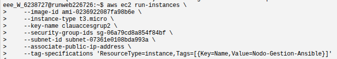 |
| :---: |
| Comanda de creació de la instància Node de Gestió Ansible |

| 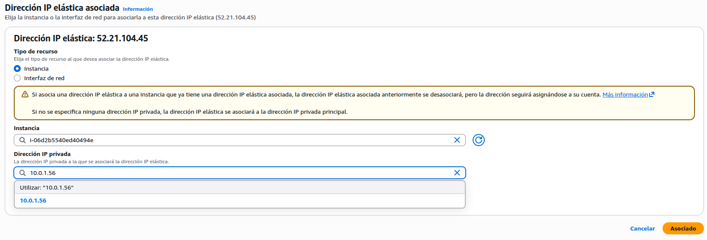 |
| :---: |
| Assignació de ip pública a la màquina |
---
Accedim al node de gestió i preparem l'entorn:

| 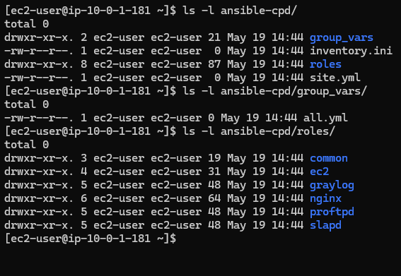 |
| :---: |
| Estructura de carpetes creada |
---
### Configuració de credencials AWS al node de gestió
El primer que es farà es crear les instàncies tant del servei web + sftp com del LDAP amb un playbook.  
Abans de poder utilitzar Ansible per crear instàncies EC2 a AWS, cal configurar
les credencials d'accés al node de gestió. Com que s'utilitza AWS Academy,
les credencials (Access Key, Secret Key i Session Token) es generen
temporalment a cada sessió del Learner Lab i s'han de renovar cada cop que
es reinicia el laboratori.

Les credencials s'emmagatzemen al fitxer `~/.aws/credentials` del node de
gestió, que és el lloc estàndard on tant la CLI d'AWS com Ansible (a través
de boto3) van a buscar-les automàticament per autenticar-se contra l'API d'AWS.

Un cop configurades, Ansible podrà interactuar amb AWS per crear i configurar
les instàncies EC2 sense necessitat de introduir cap credencial manualment
durant l'execució dels playbooks.

| 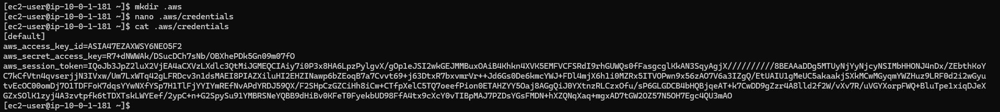 |
| :---: |
| Credencials configuradas al node de gestió |
---
### Creació de les dos instàncies amb Ansible

Per usar el mòdul amazon.aws d'Ansible necessites tenir instal·lada la col·lecció i la llibreria Python boto3:

| 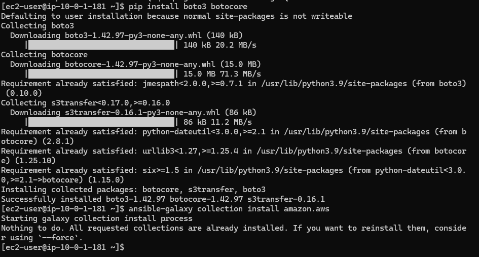 |
| :---: |
| Instal·lació boto3 |

Ara els fitxers. Primer el group_vars/all.yml només amb el que necessitem per crear les màquines:

| 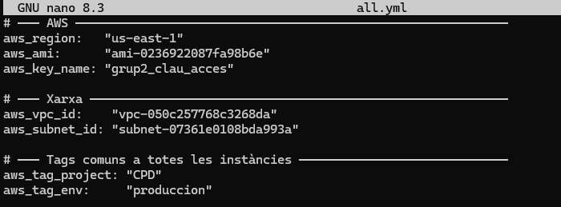 |
| :---: |
| Variables definides per a la creació d'instàncies |

Ara /vars/main.yml del rol on definirem les instàncies, el nom, el scurity group...:

| 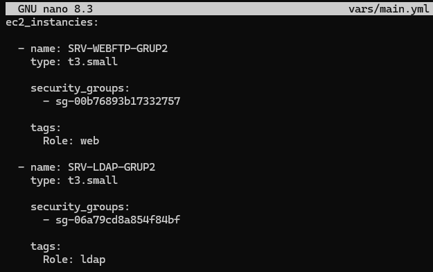 |
| :---: |
| Definició de las instàncies a les variables del rol |

Ara el site.yml que és el playbook principal que actualment s’encarrega d’orquestrar la creació d’instàncies EC2 a AWS mitjançant el role ec2:

| 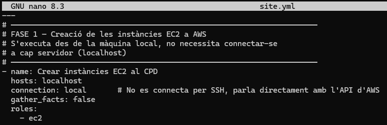 |
| :---: |
| Configuració del site.yml |

Ara el inventory.ini que es divideix en dos fases la primera durant la creació de les instàncies que es treballarà en local  
i la segona fase on ja podrem omplir les dades del inevntari una vegada les màquines estiguin creades correctament:

| 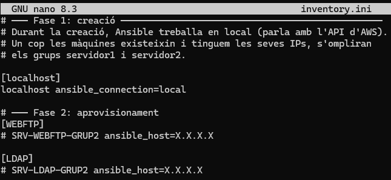 |
| :---: |
| Configuració del inventory.ini |

Ara el tasks/main.yml del rol, que és on passa tot, en aquest cas deixo el playbook en format de text:

## EC2 Playbook (Ansible)

```yaml
---
---
# ─────────────────────────────────────
# CREAR INSTÀNCIES EC2
# ─────────────────────────────────────

- name: Crear instancias EC2
  amazon.aws.ec2_instance:

    name: "{{ item.name }}"
    region: "{{ aws_region }}"

    instance_type: "{{ item.type }}"
    image_id: "{{ aws_ami }}"

    key_name: "{{ aws_key_name }}"
    subnet_id: "{{ aws_subnet_id }}"

    security_groups: "{{ item.security_groups }}"

    tags: "{{ item.tags | combine({
      'Project': aws_tag_project,
      'Env': aws_tag_env
    }) }}"

    state: running
    wait: true

  loop: "{{ ec2_instancies }}"
  register: ec2_result


# ─────────────────────────────────────
# RESERVAR ELASTIC IP
# ─────────────────────────────────────

- name: Reservar Elastic IP
  amazon.aws.ec2_eip:
    region: "{{ aws_region }}"
    in_vpc: true
    state: present

  loop: "{{ ec2_result.results }}"
  register: eip_result


# ─────────────────────────────────────
# ASOCIAR ELASTIC IP
# ─────────────────────────────────────

- name: Asociar Elastic IP
  amazon.aws.ec2_eip:
    region: "{{ aws_region }}"
    device_id: "{{ item.0.instances[0].instance_id }}"
    public_ip: "{{ item.1.public_ip }}"
    in_vpc: true
    state: present

  loop: "{{ ec2_result.results | zip(eip_result.results) | list }}"


# ─────────────────────────────────────
# RESUMEN FINAL
# ─────────────────────────────────────

- name: Mostrar resumen de instancias creadas
  debug:
    msg: >
      {{ item.0.item.name }} → {{ item.1.public_ip }}

  loop: "{{ ec2_result.results | zip(eip_result.results) | list }}"

```

## Execució del playbook y verificació de que tot ha funcionat correctament:

Primer cal fer un ping per verificar que l'inventari esta responent:

| 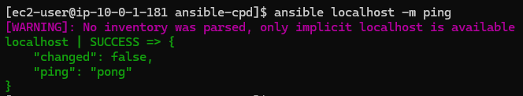 |
| :---: |
| Ping al inventari |

Ara desde el directori base d'ansible ja podem executar el playbook indicant el nom del arxiu site.yml:

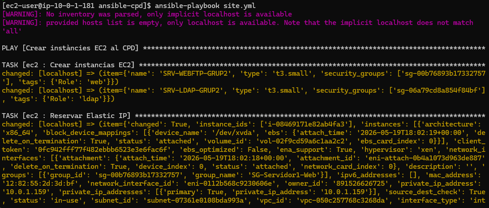

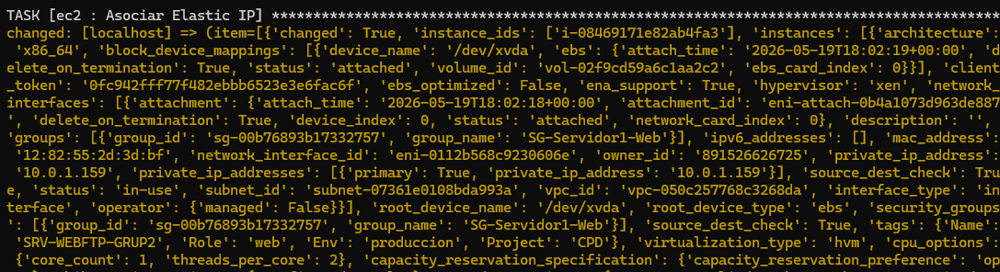

| 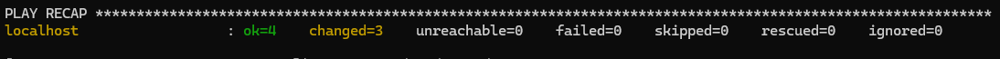 |
| :---: |
| Execució Playbook |
  

Captures de pantalla de verificació:

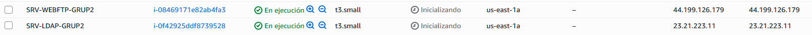

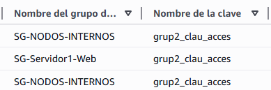

|  |
| :---: |
| Verificacions |
  
## Configuracions comuns als servidors

Ara es deixa completament preparat l'entorn realizant les següents tasques comuns als servidors:

- Creació d'usuari de gestió amb permisos d'administrador sense contrasenya
- Creació d'una clau per a que l'acces a les màquines sigui exclusivament per SSH sense contraenya.
- Instal·lació de rsyslog i enviament de logs al servidor que els centralitza

Primer cal editar el inventari, perque les màquines ja estan operatives i tenim les seves dades, també farem una agrupació al inventari per facilitar la gestió de tasques comuns:

| 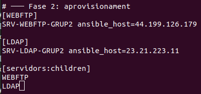 |
| :---: |
| Inventari actualitzat |

Generar la clau que es distribuira:

| 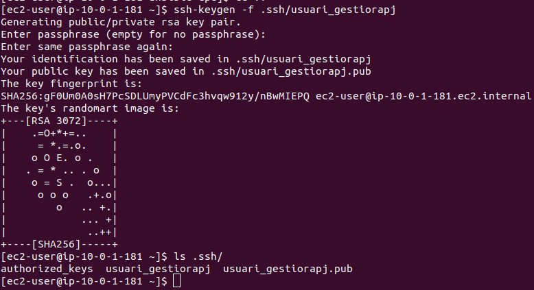 |
| :---: |
| Genreació de la clau |

Editar el fitxer de variables locals, afegim el nom del usuari que es crearà, el nom de la clau i on es copiarà, es copia automàticament al fitxer authorized_keys de l'usuari **`usuari_gestiorapj`** a cada servidor.  
Això permet que **`usuari_gestiorapj`** entri per SSH sense haver d'introduir cap contrasenya.:

| 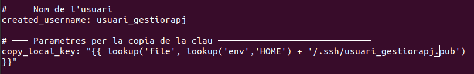 |
| :---: |
| Fitxer group_vars/all.yml |

Editar el site.yml i afegir el següent:

| 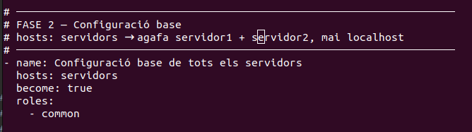 |
| :---: |
| Fitxer site.yml |

Editar el fitxer handler del rol per reiniciar serveis:

| 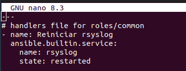 |
| :---: |
| Fitxer handlers/main.yml |

Utilitzarem el rol common hi ha que editar el tasks/main.yml del rol:

```yaml
---
# ── 1. Actualització del sistema ─────────────────────────────────────
- name: Actualitzar la llista i tots els paquets del sistema
  ansible.builtin.dnf:
    name: "*"
    state: latest
    update_cache: true

- name: Eliminar paquets i dependències obsoletes (Autoremove)
  ansible.builtin.dnf:
    autoremove: true

# ── 2. Crear usuari i fer que no necessiti contrasenya ─────────────────────────────────────
- name: Create user ansible
  ansible.builtin.user:
    name: "{{ created_username }}"
    shell: /bin/bash
    state: present
    create_home: yes

- name: Setup passwordless sudo for user ansible
  ansible.builtin.lineinfile:
    path: /etc/sudoers.d/90-cloud-init-users
    state: present
    line: "{{ created_username }} ALL=(ALL) NOPASSWD:ALL"
    insertafter: EOF

# ── 3. Distribuir i copiar la clau ─────────────────────────────────────
- name: Set authorized keys taken from url
  ansible.posix.authorized_key:
    user: "{{ created_username }}"
    state: present
    key: "{{ copy_local_key }}"

# ── 4. Canviar el Hostname del sistema ─────────────────────────────────────
- name: Configurar el hostname permanent de la màquina
  ansible.builtin.hostname:
    name: "{{ inventory_hostname | lower }}"

# ── 5. Instal·lació i configuració de Rsyslog ──────────────────────────────
- name: Assegurar que rsyslog està instal·lat
  ansible.builtin.dnf:
    name: rsyslog
    state: present

- name: Assegurar que el servei rsyslog està actiu i arrenca amb el sistema
  ansible.builtin.service:
    name: rsyslog
    state: started
    enabled: true

- name: Afegir la regla de reenviament al rsyslog.conf
  ansible.builtin.lineinfile:
    path: /etc/rsyslog.conf
    state: present
    line: '*.* @10.0.4.242:514;RSYSLOG_SyslogProtocol23Format'
    insertafter: EOF
  notify: Reiniciar rsyslog

- name: Forçar l'execució immediata del handler si hi ha hagut canvis
  ansible.builtin.meta: flush_handlers

- name: Enviar un log de prova
  ansible.builtin.command:
    cmd: 'logger -p syslog.info "Test log des de {{ ansible_facts[\"hostname\"] }}"'
```
## Execució del playbook y verificació de que tot ha funcionat correctament:

Primer cal fer un ping per verificar que l'inventari esta responent, auqesta vegada cal indicar la clau perquè son màquines remotes:

| 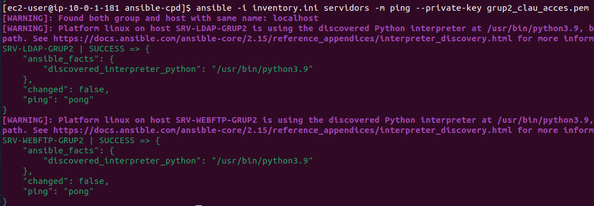 |
| :---: |
| Ping al inventari |

Ara desde el directori base d'ansible ja podem executar el playbook indicant el nom del arxiu site.yml:

| 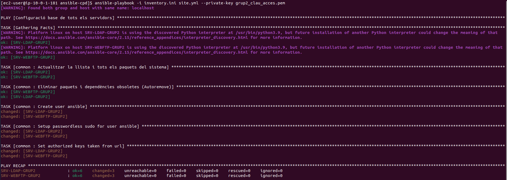 |
| :---: |
| Execució playbook |

Verificació de que tot ha funcionat correctament:

La connexió ssh amb la clau creada respon root tot esta correcte:

| 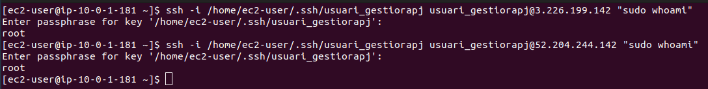 |
| :---: |
| Verificació |

També verifiquem que s'ha canviat el hostname:

| 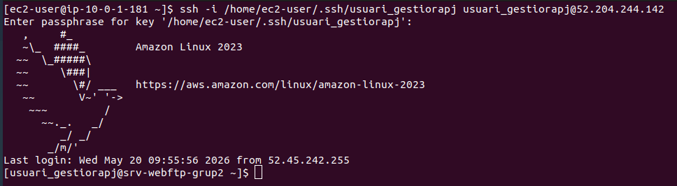 |
| :---: |
| Verificació Hostname WEBFTP|

| 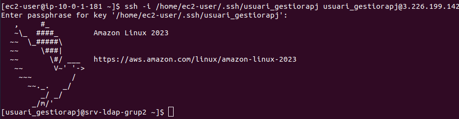 |
| :---: |
| Verificació Hostname LDAP|
### 2.2 02-aws/arquitectura.md

*Documento vacío.*

# 2.3 02-aws/ldap.md

Aquesta es una de les màquines que es gestiona amb amb ansible per lo que tota la configuració es fa desde el node de gestió mitjançant un playbook.

## Configuració feta amb Ansible

Primer de tot cal configurar una nova entrada en el nostre site.yml perquè associï el nostre servidor LDAP al rol de slapd:

| 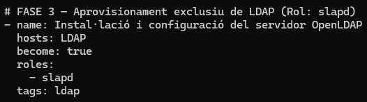 |
| :---: |
| Confiuració site.yml |

Ara cal editar el fitxer de variables del rol en aquest cas roles/slapd/vars/main.yml, on definirem el domini i la llista de usuaris. A partir d'aquí, el playbook es pot executar tantes vegades com vulguis perquè utilitza un bucle dinàmic (loop) que s'adapta automàticament a la quantitat d'usuaris sense haver de modificar mai el codi de les tasques. A més, gràcies a la condició failed_when, Ansible detecta si un usuari ja s'havia creat en una execució anterior (Already exists), saltant-se els comptes vells de forma segura per centrar-se únicament a injectar els nous registres processats mitjançant les plantilles Jinja2. Això garanteix un sistema totalment idempotent, net i escalable per al nostre entorn SFTP.

Arxiu en format de text:

```yaml
---
# Configuració del Domini LDAP
ldap_domain_dc: "dc=pro-ASIXcA1-grup2,dc=local"
ldap_organization: "Grup 2 - Projecte ASIX"
ldap_root_password: "pirineus"

# Llista d'exactament 4 usuaris per a SFTP
ldap_users:
  - username: "usuari_sftp1"
    cn: "Asier Hernandez"
    sn: "Hernandez"
    uid: 10001
    gid: 10001
    home: "/home/sftp/usuari_sftp1"
    shell: "/bin/bash"
    password: "grup2"   # Salted SHA (SSHA) hash values generated dynamically by template
    gecos: "Compte SFTP 1 - Asier"

  - username: "usuari_sftp2"
    cn: "Pablo Pineda"
    sn: "Pineda"
    uid: 10002
    gid: 10002
    home: "/home/sftp/usuari_sftp2"
    shell: "/bin/bash"
    password: "grup2"
    gecos: "Compte SFTP 2 - Pablo"

  - username: "usuari_sftp3"
    cn: "Ronald Santana"
    sn: "Santana"
    uid: 10003
    gid: 10003
    home: "/home/sftp/usuari_sftp3"
    shell: "/bin/bash"
    password: "grup2"
    gecos: "Compte SFTP 3 - Ronald"

  - username: "usuari_sftp4"
    cn: "Jair Godoy"
    sn: "Godoy"
    uid: 10004
    gid: 10004
    home: "/home/sftp/usuari_sftp4"
    shell: "/bin/bash"
    password: "grup2"
    gecos: "Compte SFTP 4 - Godoy"
```

### Ara cal editar les plantilles jinja dels arxius ldif:

| 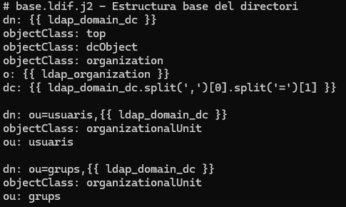 |
| :---: |
| roles/slapd/templates/base.ldif.j2 Plantilla Jinja2 per crear l'arrel del domini i les unitats organitzatives (ou=usuaris i ou=grups). |

| 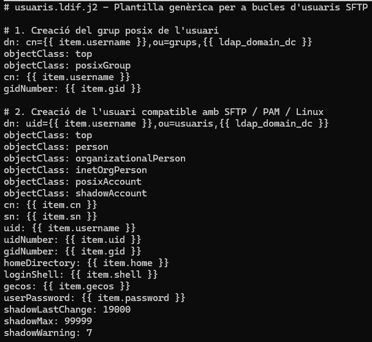 |
| :---: |
| roles/slapd/templates/usuaris.ldif.j2 Plantilla Jinja2 genérica que es processarà un cop per cada usuari definit a la llista de variables, fent-los compatibles amb SFTP/Linux.|

Ara el playbook principal roles/slapd/tasks/main.yml que executa les accions realitzades al servidor remot. Playbook en format text:

```yaml
---
# ── 1. INSTAL·LACIÓ ───────────────────────────────────────────────────
- name: Instal·lar els paquets d'OpenLDAP i el servidor slapd
  ansible.builtin.dnf:
    name:
      - openldap
      - openldap-servers
      - openldap-clients
    state: present

- name: Assegurar que el servei slapd està actiu i arrenca amb el sistema
  ansible.builtin.service:
    name: slapd
    state: started
    enabled: true

# ── CONFIGURAR CREDENCIALS INTERNES DE CONFIG (MDB/HDB) ───────
- name: Generar el hash de la contrasenya del Manager per a la configuració interna
  ansible.builtin.command:
    cmd: "slappasswd -s '{{ ldap_root_password }}'"
  register: root_password_hash
  changed_when: false

- name: Configurar el Domini i la Contrasenya del Manager a OpenLDAP intern
  ansible.builtin.shell: |
    ldapmodify -Y EXTERNAL -H ldapi:/// <<EOF
    dn: olcDatabase={2}mdb,cn=config
    changetype: modify
    replace: olcSuffix
    olcSuffix: {{ ldap_domain_dc }}
    -
    replace: olcRootDN
    olcRootDN: cn=Manager,{{ ldap_domain_dc }}
    -
    replace: olcRootPW
    olcRootPW: {{ root_password_hash.stdout }}
    EOF
  register: config_result
  failed_when:
    - config_result.rc != 0
    - "'No such object' not in config_result.stderr"
  changed_when: config_result.rc == 0

# ── CARREGAR ESQUEMES DE LINUX (MOLT IMPORTANT) ───────────────
- name: Carregar els esquemes necessaris per a usuaris Linux (cosine, nis, inetorgperson)
  ansible.builtin.command:
    cmd: "ldapadd -Y EXTERNAL -H ldapi:/// -f /etc/openldap/schema/{{ item }}.ldif"
  loop:
    - cosine
    - nis
    - inetorgperson
  register: schema_result
  failed_when:
    - schema_result.rc != 0
    - "'Duplicate' not in schema_result.stderr"
    - "'Already exists' not in schema_result.stderr"
  changed_when: schema_result.rc == 0

# ── 2. PROCESAR E INJECTAR L'ESTRUCTURA BASE ────────────────────────
- name: Renderitzar l'estructura base des de la plantilla J2
  ansible.builtin.template:
    src: base.ldif.j2
    dest: /tmp/base.ldif
    mode: '0600'

- name: Cargar l'estructura base a OpenLDAP
  ansible.builtin.command:
    cmd: "ldapadd -x -w '{{ ldap_root_password }}' -D 'cn=Manager,{{ ldap_domain_dc }}' -f /tmp/base.ldif"
  register: base_result
  failed_when:
    - base_result.rc != 0
    - "'Already exists' not in base_result.stderr"

# ── 3. BUCLE PER PROCESAR E INJECTAR MÚLTIPLES USUARIS ─────────────
- name: Renderitzar la plantilla LDIF per a cada usuari de la llista
  ansible.builtin.template:
    src: usuarios.ldif.j2
    dest: "/tmp/{{ item.username }}.ldif"
    mode: '0600'
  loop: "{{ ldap_users }}"

- name: Cargar cada usuari a OpenLDAP de manera individual
  ansible.builtin.command:
    cmd: "ldapadd -x -w '{{ ldap_root_password }}' -D 'cn=Manager,{{ ldap_domain_dc }}' -f /tmp/{{ item.username }}.ldif"
  register: users_result
  failed_when:
    - users_result.rc != 0
    - "'Already exists' not in users_result.stderr"
  loop: "{{ ldap_users }}"
```
### Execució i verificacions:

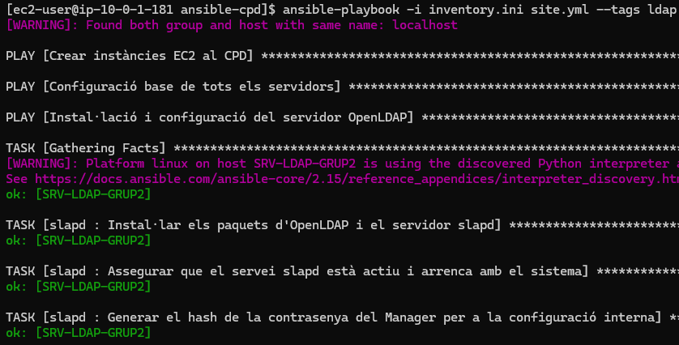

| 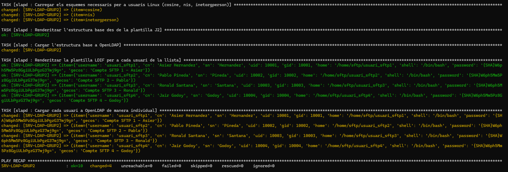 |
| :---: |
| Execució del playbook |

### Verificacions:

Ens conectem via ssh amb l'usuari de gestió i amb filtres ldapsearch mirem que tot s'ha creat correctament:

| 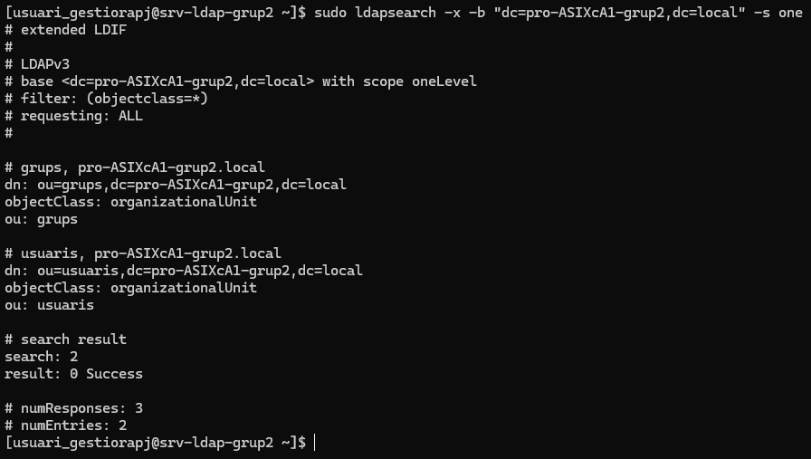 |
| :---: |
| Estructura base |


| 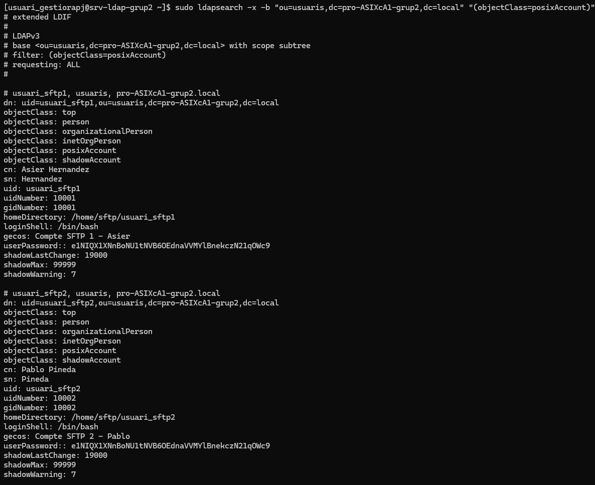 |
| :---: |
| Llista d'Usuaris |

| 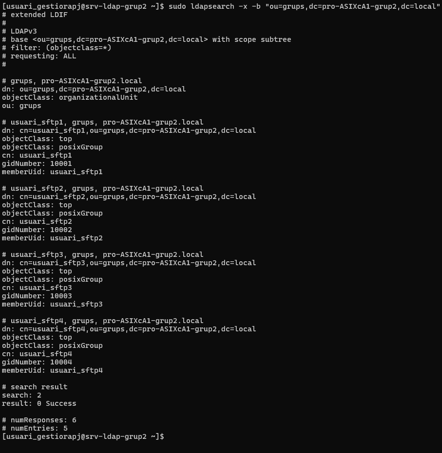 |
| :---: |
| Llista de grups |

### 2.4 02-aws/servei-logs-graylog.md

*Documento vacío.*

### 2.5 02-aws/usuaris-admin.md

*Documento vacío.*

# 2.6 02-aws/web-sftp.md

## 2.6.1 Servei SFTP

Inicialment es va plantejar utilitzar ProFTPD com a servidor SFTP, però durant la posada en marxa es va comprovar que la integració amb SSSD i l'autenticació LDAP presentava problemes de compatibilitat en l'entorn Amazon Linux 2023.
Per aquest motiu, es va optar per utilitzar el subsistema SFTP natiu d'OpenSSH (openssh-server), que ofereix la mateixa funcionalitat de manera més estable i sense dependències addicionals.
El rol Ansible sftp s'encarrega de:

- Instal·lar i configurar openssh-server
- Configurar sshd_config per habilitar el subsistema SFTP
- Integrar l'autenticació amb LDAP mitjançant SSSD
- Crear automàticament els directoris home dels usuaris amb oddjob + mkhomedir
- Aplicar la política criptogràfica LEGACY per compatibilitat amb els hashes SHA-1 del servidor LDAP

### Configuració feta amb Ansible

Primer de tot afegir la nova entrada al nostre `site.yml` perquè associï el nostre servei SFTP al rol `sftp`:

| 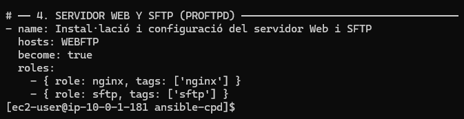 |
| :---: |
| `site.yml` |

Ara hem d'editar les variables del rol `roles/sftp/vars/main.yml`, aquí definirem les dades de connexió amb el servidor LDAP i el port SFTP:

| 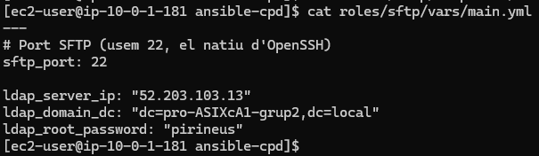 |
| :---: |
| `roles/sftp/vars/main.yml` |

Ara editem les plantilles d'arxius roles/proftpd/templates/proftpd.conf.j2 i roles/proftpd/templates/ldap.conf.j2.  

`roles/sftp/templates/sshd_config.j2` — configuració d'OpenSSH per habilitar el subsistema SFTP natiu, autenticació per contrasenya i integració amb PAM/SSSD

```yaml
Include /etc/ssh/sshd_config.d/*.conf

Port 22
PermitRootLogin no

PasswordAuthentication yes
UsePAM yes

# Configuración del subsistema interno de SFTP
Subsystem sftp internal-sftp

# CONFIGURACIÓN DE CHROOT PARA USUARIOS LDAP SFTP
# ─────────────────────────────────────────────────────────────────────
Match User usuari_sftp1,usuari_sftp2,usuari_sftp3,usuari_sftp4
    ChrootDirectory /home/sftp
    ForceCommand internal-sftp
    AllowTcpForwarding no
    X11Forwarding no
```

`roles/sftp/templates/sssd.conf.j2` — configuració del client LDAP via SSSD: mapatge d'atributs, unitats organitzatives (`ou=usuaris`, `ou=grups`) i creació automàtica de directoris home dels usuaris

```yaml
[sssd]
services = nss, pam
config_file_version = 2
domains = default

[domain/default]
id_provider = ldap
auth_provider = ldap

ldap_uri = ldap://{{ ldap_server_ip }}
ldap_search_base = {{ ldap_domain_dc }}

ldap_default_bind_dn = cn=Manager,{{ ldap_domain_dc }}
ldap_default_authtok = {{ ldap_root_password }}

cache_credentials = true
enumerate = true

# Creación de los home dirs
fallback_homedir = /home/sftp/%u
default_shell = /bin/bash

# 1. Evita que SSSD exija certificados TLS/SSL
ldap_tls_reqcert = allow
ldap_id_use_start_tls = false

# 2. PERMITE AUTENTICACIÓN POR CONTRASEÑA SIN TLS (EL FIX DEFINITIVO)
ldap_auth_disable_tls_never_use_in_production = true

# 3. MAPEO CORRECTO DE TUS UNIDADES ORGANIZATIVAS
ldap_user_search_base = ou=usuaris,{{ ldap_domain_dc }}
ldap_group_search_base = ou=grups,{{ ldap_domain_dc }}
```
`roles/sftp/tasks/main.yml` — el flux d'execució que instal·larà els paquets (`openssh-server`, `sssd`, `oddjob`), crearà l'entorn de directoris, injectarà les configuracions i activarà els serveis necessaris:
```yaml
---
# ─────────────────────────────────────────────
# PAQUETES NECESARIOS
# ─────────────────────────────────────────────
- name: Instalar stack LDAP client + SSH
  ansible.builtin.dnf:
    name:
      - openssh-server
      - sssd
      - sssd-ldap
      - oddjob
      - oddjob-mkhomedir
      - authselect
    state: present

# ─────────────────────────────────────────────
# DIRECTORIOS Y SSH KEYS
# ─────────────────────────────────────────────
- name: Generar hostkeys SSH
  ansible.builtin.command: ssh-keygen -A
  args:
    creates: /etc/ssh/ssh_host_rsa_key

- name: Crear directori base per als usuaris SFTP
  ansible.builtin.file:
    path: /home/sftp
    state: directory
    owner: root
    group: root
    mode: '0755'

# ─────────────────────────────────────────────
# SSSD CONFIG (LDAP CLIENT)
# ─────────────────────────────────────────────
- name: Configurar SSSD
  ansible.builtin.template:
    src: sssd.conf.j2
    dest: /etc/sssd/sssd.conf
    mode: '0600'

# ─────────────────────────────────────────────
# PARCHE CRYPTO LEGACY (REQUISITO PARA ENTORNO SHA)
# ─────────────────────────────────────────────
- name: Cambiar la política criptográfica del sistema a LEGACY para permitir hashes SHA-1
  ansible.builtin.command: update-crypto-policies --set LEGACY
  changed_when: true

# ─────────────────────────────────────────────
# ENABLE SSSD & CLEAN CACHE
# ─────────────────────────────────────────────
- name: Vaciar caché previa de SSSD
  ansible.builtin.command: sss_cache -E
  changed_when: true
  failed_when: false

- name: Reiniciar SSSD
  ansible.builtin.systemd:
    name: sssd
    state: restarted
    enabled: true

# ─────────────────────────────────────────────
# ENABLE PAM PROFILE (SSSD + MKHOMEDIR)
# ─────────────────────────────────────────────
- name: Configurar authselect para activar SSSD y creación automática de homes
  ansible.builtin.command: authselect select sssd with-mkhomedir --force
  changed_when: true

- name: Activar oddjobd
  ansible.builtin.systemd:
    name: oddjobd
    state: started
    enabled: true

# ─────────────────────────────────────────────
# PARCHE CLOUD-INIT (AWS SSH_PWAUTH)
# ─────────────────────────────────────────────
- name: Permitir autenticación por contraseña en cloud-init (AWS EC2 Fix)
  ansible.builtin.lineinfile:
    path: /etc/cloud/cloud.cfg
    regexp: '^ssh_pwauth:.*'
    line: 'ssh_pwauth: true'
    state: present

# ─────────────────────────────────────────────
# SSH CONFIG (SFTP REAL)
# ─────────────────────────────────────────────
- name: Configurar sshd_config
  ansible.builtin.template:
    src: sshd_config.j2
    dest: /etc/ssh/sshd_config
    mode: '0600'

- name: Reiniciar SSH
  ansible.builtin.systemd:
    name: sshd
    state: restarted
    enabled: true
```

### Execució i verificacions:

| 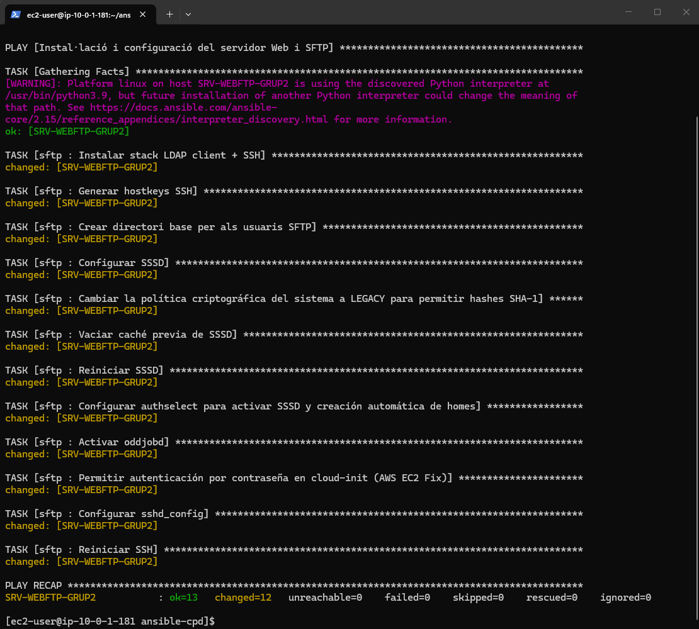 |
| :---: |
| Execució del playbook |

Verificació desde una altra màquina que es pot accedir al servei sftp amb un usuari de LDAP i realitzar accions engaviats al seu directori:

Previament he creat un arxiu de prova a la màquina que pujarà l'arxiu al servidor sftp:

| 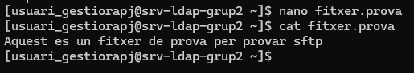 |
| :---: |
| Fitxer prova |

Conexió SFTP amb un usuari LDAP desde una màquina en aquest cas he escollit el srv ldap:

| 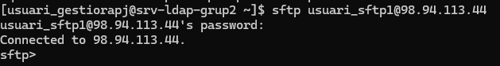 |
| :---: |
| Conexió SFTP |

Comprovació de que l'usuari esta a la seva home i està engaviat:

| 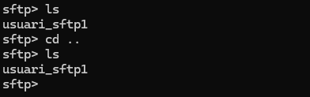 |
| :---: |
| Demostració Home de l'usuari engaviat |

Pujada d'un fitxer i comprovació de que ha estat correcte:

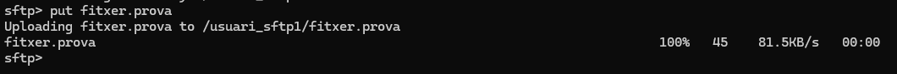

| 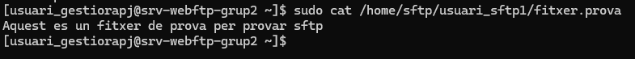 |
| :---: |
| Pujada d'un fitxer i comprovació |

## 2.6.2 Servei Web Nginx

### Configuració feta amb Ansible

En aquest cas no fa falta editar el site.yml perquè anteriorment configurant el servei de sftp ja l'hem configurat perquè puguem també tenir el servei web ja que estan en la mateixa màquina.

`roles/nginx/vars/main.yml`, En aquest fitxer es defineixen les variables pròpies del rol nginx. S'hi especifica el port d'escolta, el nom del servidor (en aquest cas la IP elàstica de la instància), el directori arrel on es servirà l'aplicació, la URL del repositori a clonar i el directori de destí. Centralitzar aquestes dades aquí permet modificar qualsevol paràmetre sense tocar el codi de les tasques.

| 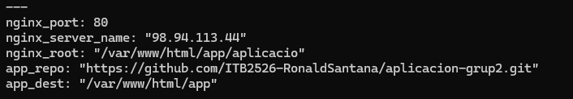 |
| :---: |
| `roles/nginx/vars/main.yml` |  
  
`roles/nginx/templates/vhost.conf.j2`, Aquesta és la plantilla Jinja2 que genera la configuració del virtualhost de Nginx. A diferència d'un servidor de fitxers estàtics, s'hi afegeix el bloc location ~ \.php$ que redirigeix totes les peticions PHP al procés php-fpm mitjançant el socket Unix. Ansible substitueix les variables pels valors de vars/main.yml en el moment del desplegament.

| 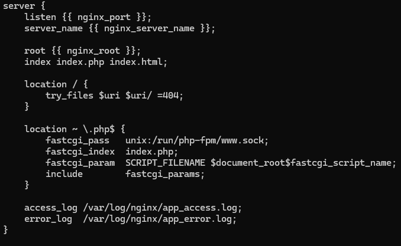 |
| :---: |
| `roles/nginx/templates/vhost.conf.j2`|  

`roles/nginx/handlers/main.yml`, n'hi ha dos: un per reiniciar nginx quan canvia la configuració del virtualhost, i un altre per reiniciar php-fpm quan es modifica la seva configuració d'usuari. Això evita reinicis innecessaris si no hi ha hagut cap canvi.

| 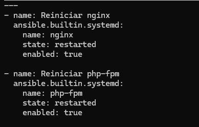 |
| :---: |
| `roles/nginx/handlers/main.yml`|

`roles/nginx/tasks/main.yml`, Aquest és el playbook principal del rol. S'estructura en sis blocs diferenciats: primer s'instal·len els paquets necessaris i s'activa el servei, després es clona el repositori de l'aplicació i s'ajusten els permisos, s'aplica la política SELinux necessària per a Amazon Linux 2023, es desplega la configuració del virtualhost, s'obre el port 80 al firewall i finalment es verifica que el servei respon correctament.

```yaml
---
# ── 1. INSTAL·LACIÓ ───────────────────────────────────────────────────
- name: Instal·lar nginx, git i PHP
  ansible.builtin.dnf:
    name:
      - nginx
      - git
      - php
      - php-fpm
      - php-mysqlnd
      - php-mbstring
      - php-xml
    state: present

- name: Assegurar que nginx està actiu i arrenca amb el sistema
  ansible.builtin.systemd:
    name: nginx
    state: started
    enabled: true

- name: Assegurar que php-fpm està actiu i arrenca amb el sistema
  ansible.builtin.systemd:
    name: php-fpm
    state: started
    enabled: true

# ── 2. CLONAR REPOSITORI ─────────────────────────────────────────────
- name: Crear directori destí de l'aplicació
  ansible.builtin.file:
    path: "{{ app_dest }}"
    state: directory
    owner: nginx
    group: nginx
    mode: '0755'

- name: Clonar el repositori de l'aplicació
  ansible.builtin.command:
    cmd: "git clone {{ app_repo }} {{ app_dest }}"
    creates: "{{ app_dest }}/.git"

- name: Ajustar propietari dels fitxers clonats
  ansible.builtin.file:
    path: "{{ app_dest }}"
    owner: nginx
    group: nginx
    recurse: true

# ── 3. SELINUX (Amazon Linux 2023) ───────────────────────────────────
- name: Permetre a nginx llegir el directori de l'app (SELinux)
  ansible.builtin.command:
    cmd: "chcon -Rt httpd_sys_content_t {{ app_dest }}"
  changed_when: true
  failed_when: false

# ── 4. CONFIGURAR PHP-FPM PER EXECUTAR COM NGINX ─────────────────────
- name: Configurar php-fpm per usar l'usuari nginx
  ansible.builtin.lineinfile:
    path: /etc/php-fpm.d/www.conf
    regexp: "{{ item.regexp }}"
    line: "{{ item.line }}"
  loop:
    - { regexp: '^user =',  line: 'user = nginx' }
    - { regexp: '^group =', line: 'group = nginx' }
  notify: Reiniciar php-fpm

- name: Assegurar propietari correcte dels directoris de sessió i caché de PHP
  ansible.builtin.file:
    path: "{{ item }}"
    owner: nginx
    group: nginx
    state: directory
    recurse: true
  loop:
    - /var/lib/php/session
    - /var/lib/php/wsdlcache
    - /var/lib/php/opcache
  failed_when: false

# ── 5. VIRTUALHOST ────────────────────────────────────────────────────
- name: Desplegar configuració del virtualhost
  ansible.builtin.template:
    src: vhost.conf.j2
    dest: /etc/nginx/conf.d/app.conf
    mode: '0644'
  notify: Reiniciar nginx

# ── 6. FIREWALL ───────────────────────────────────────────────────────
- name: Obrir port 80 al firewall
  ansible.builtin.command:
    cmd: firewall-cmd --permanent --add-service=http
  changed_when: true
  failed_when: false

- name: Recarregar firewall
  ansible.builtin.command:
    cmd: firewall-cmd --reload
  changed_when: true
  failed_when: false

# ── 7. VERIFICACIÓ ────────────────────────────────────────────────────
- name: Verificar que nginx respon al port 80
  ansible.builtin.uri:
    url: "http://localhost:80"
    status_code: 200
  register: nginx_check
  retries: 3
  delay: 5

- name: Mostrar resultat de la verificació
  ansible.builtin.debug:
    msg: "Nginx operatiu — codi HTTP: {{ nginx_check.status }}"

```

### Execució i verificacions:

#### Execució:

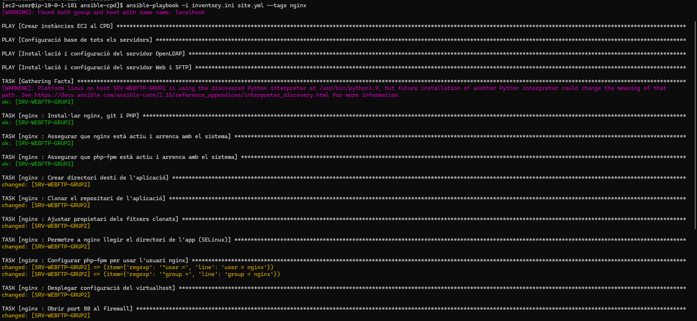

| 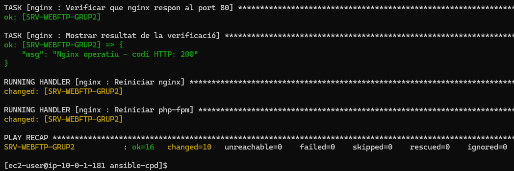 |
| :---: |
| Execució del playbook, com podem veure el playbook també verifica que Nginx respon al port 80|

#### Verificació:

Accedim desde un navegador a la nostra ip pública elàstica de la màquina del servei web i podem veure la nostra aplicació:

| 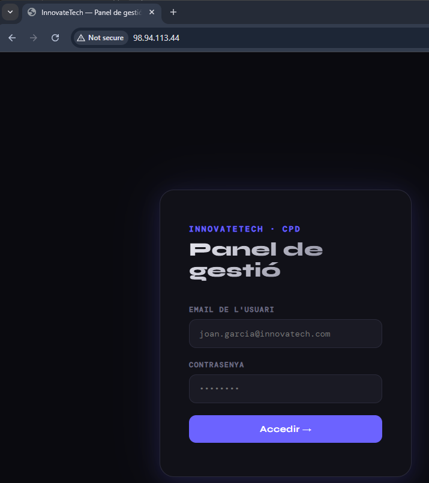 |
| :---: |
| Verificació accés a la aplicació desde el navegador |

### Capturas 02-aws
- `capturas/02-aws/RED/VPC.png` — Diagrama de la VPC.
- `capturas/02-aws/RED/SUBNETPublica.png` — Subnet pública.
- `capturas/02-aws/RED/SUBNETPrivada.png` — Subnet privada.
- `capturas/02-aws/RED/IGW-Publico.png` — Gateway d'internet públic.
- `capturas/02-aws/RED/NAT-Privado.png` — NAT per a subnets privades.
- `capturas/02-aws/RED/TABLAPRIVADA.png` — Taula de rutes de la subnet privada.
- `capturas/02-aws/RED/ROUTEPUBLICA.png` — Regla de ruta pública.
- `capturas/02-aws/RED/ROUTENAT.png` — Regla de ruta NAT.
- `capturas/02-aws/RED/IPELASTICA.png` — IP elàstica configurada.
- `capturas/02-aws/CREACION-NODO-ANSIBLE.png` — Creació del node Ansible.
- `capturas/02-aws/ASIGNACION-IP-FIJA-PUBLICA.png` — Assignació d’IP pública fixa.
- `capturas/02-aws/ESTRUCTURA-CARPETAS.png` — Estructura de carpetes de l’entorn Ansible.
- `capturas/02-aws/CREDENCIALES-CONFIGURADAS.png` — Credencials d’AWS configurades.
- `capturas/02-aws/INSTALACION-BOTO3.png` — Instal·lació de boto3.
- `capturas/02-aws/VARIABLES_CREACIO_INSTANCIES.png` — Variables de creació d’instàncies.
- `capturas/02-aws/VARIABLES-ROL.png` — Variables de rol.
- `capturas/02-aws/SITE.png` — Fitxer site Ansible inicial.
- `capturas/02-aws/SITE_ACTUALITZAT.png` — Fitxer site Ansible actualitzat.
- `capturas/02-aws/INVENTORY.png` — Inventari Ansible.
- `capturas/02-aws/INVENTARI_ACTUALITZAT.png` — Inventari Ansible actualitzat.
- `capturas/02-aws/INVENTARI_ACTUALITZAT2.png` — Inventari Ansible addicional.
- `capturas/02-aws/PINGINVENTARI.png` — Ping d’inventari Ansible.
- `capturas/02-aws/PING_INVENTARI2.png` — Ping d’inventari Ansible addicional.
- `capturas/02-aws/EJECUCION1.png` — Execució Ansible pas 1.
- `capturas/02-aws/EJECUCION2.png` — Execució Ansible pas 2.
- `capturas/02-aws/EJECUCION3.png` — Execució Ansible pas 3.
- `capturas/02-aws/EXECUCIO_COMU.png` — Execució comuna d’Ansible.
- `capturas/02-aws/VERIFICACION1.png` — Verificació Ansible pas 1.
- `capturas/02-aws/VERIFICACION2.png` — Verificació Ansible pas 2.
- `capturas/02-aws/VERIFICACION3.png` — Verificació Ansible pas 3.
- `capturas/02-aws/GENERAR_CLAU.png` — Generació de clau SSH.
- `capturas/02-aws/VARIABLES_COMUNS.png` — Variables comunes.
- `capturas/02-aws/HANDLERCOMUN.png` — Handlers comuns.
- `capturas/02-aws/SRV-ANSIBLE-GRUP2/SRV-ANS.png` — Captura del servidor Ansible.
- `capturas/02-aws/SRV-LDAP-GRUP2/SRV-LDAP.png` — Captura del servidor LDAP.
- `capturas/02-aws/SRV-BBDD-GRUP2/SRV-BBDD.png` — Captura del servidor de bases de dades.
- `capturas/02-aws/SRV-LOGS-GRUP2/SRV-LOGS.png` — Captura del servidor de logs.
- `capturas/02-aws/SRV-WEBFTP-GRUP2/CREACION1.png` — Procés de creació Web/SFTP, pas 1.
- `capturas/02-aws/SRV-WEBFTP-GRUP2/CREACION2.png` — Procés de creació Web/SFTP, pas 2.
- `capturas/02-aws/SRV-WEBFTP-GRUP2/CREACION3.png` — Procés de creació Web/SFTP, pas 3.
- `capturas/02-aws/SRV-WEBFTP-GRUP2/CREACION4.png` — Procés de creació Web/SFTP, pas 4.
- `capturas/02-aws/SRV-LDAP-GRUP2/SITEYML_LDAP.png` — Fitxer site LDAP.
- `capturas/02-aws/SRV-LDAP-GRUP2/JINJA_BASE.png` — Plantilla Jinja base LDAP.
- `capturas/02-aws/SRV-LDAP-GRUP2/JINJA_USUARIS.png` — Plantilla Jinja de creació d’usuaris.
- `capturas/02-aws/SRV-LDAP-GRUP2/EJECUCION1.png` — Execució de playbook LDAP.
- `capturas/02-aws/SRV-LDAP-GRUP2/EJECUCION2.png` — Execució de playbook LDAP (resultats).
- `capturas/02-aws/SRV-LDAP-GRUP2/ESTRUCTURA_BASE.png` — Estructura base del directori LDAP.
- `capturas/02-aws/SRV-LDAP-GRUP2/LLISTA_USUARIS.png` — Llista d’usuaris LDAP.
- `capturas/02-aws/SRV-LDAP-GRUP2/LLISTA_USUARIS2.png` — Llista addicional d’usuaris LDAP.
- `capturas/02-aws/SRV-LDAP-GRUP2/LLISTA_GRUPS.png` — Llista de grups LDAP.
- `capturas/02-aws/SRV-LOGS-GRUP2/INSTALACION-JAVA.png` — Instal·lació de Java per Graylog.
- `capturas/02-aws/SRV-LOGS-GRUP2/INSTALACION-MONGO.png` — Instal·lació de MongoDB.
- `capturas/02-aws/SRV-LOGS-GRUP2/INSTALACION-OPENSEARCH.png` — Instal·lació d’OpenSearch.
- `capturas/02-aws/SRV-LOGS-GRUP2/INSTALACION-GRAYLOG.png` — Instal·lació de Graylog.
- `capturas/02-aws/SRV-LOGS-GRUP2/PREPARACION-OPENSEARCH.png` — Preparació d’OpenSearch.
- `capturas/02-aws/SRV-LOGS-GRUP2/PREPARACION-OPENSEARCH2.png` — Segona preparació d’OpenSearch.
- `capturas/02-aws/SRV-LOGS-GRUP2/PREPARACION-GRAYLOG.png` — Preparació de Graylog.
- `capturas/02-aws/SRV-LOGS-GRUP2/PREPARACION-GRAYLOG2.png` — Segona preparació de Graylog.
- `capturas/02-aws/SRV-LOGS-GRUP2/SERVERCONF-GRAYLOG.png` — Configuració del servidor Graylog.
- `capturas/02-aws/SRV-LOGS-GRUP2/REPOSITORIO-MONGO.png` — Repositori MongoDB.
- `capturas/02-aws/SRV-LOGS-GRUP2/REPOSITORIO-OPENSEARCH.png` — Repositori OpenSearch.
- `capturas/02-aws/SRV-LOGS-GRUP2/HOME-JAVA.png` — Pàgina d’inici de Java.
- `capturas/02-aws/SRV-LOGS-GRUP2/JAVA-COMPROBACION.png` — Comprovació de Java.
- `capturas/02-aws/SRV-LOGS-GRUP2/MONGODB-COMPROBACION.png` — Comprovació de MongoDB.
- `capturas/02-aws/SRV-LOGS-GRUP2/GRAYLOG-COMPROBACION.png` — Comprovació de Graylog.
- `capturas/02-aws/SRV-LOGS-GRUP2/GRAYLOG-PAGINA.png` — Pàgina de Graylog.

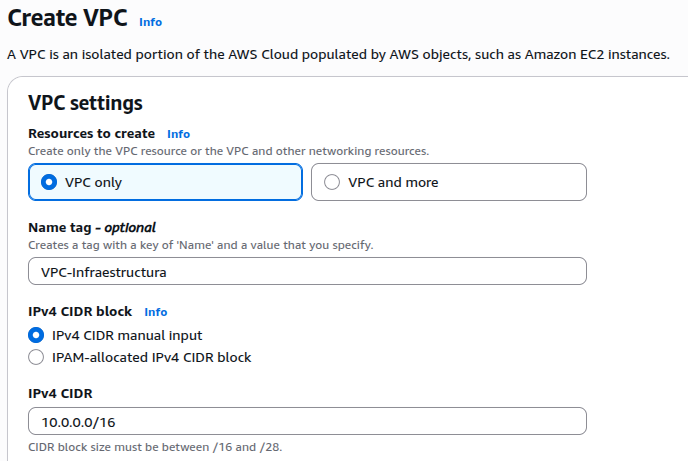
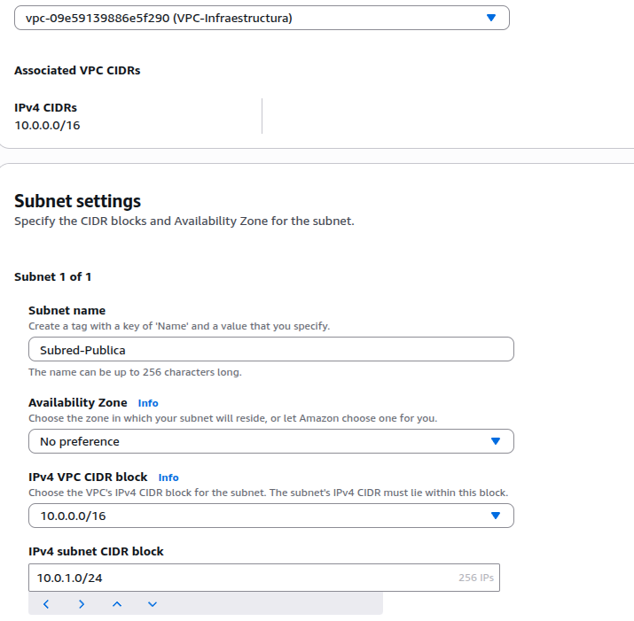
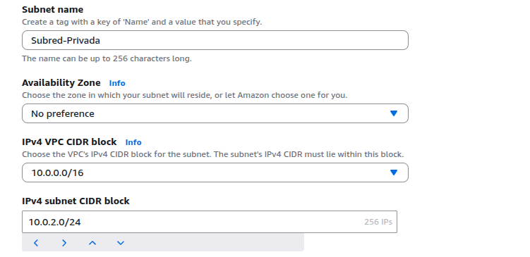
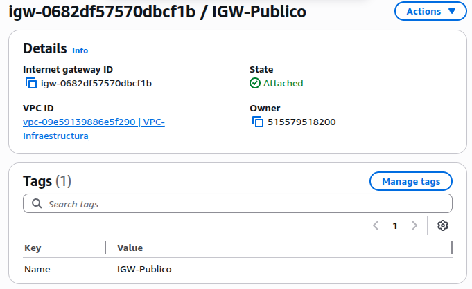
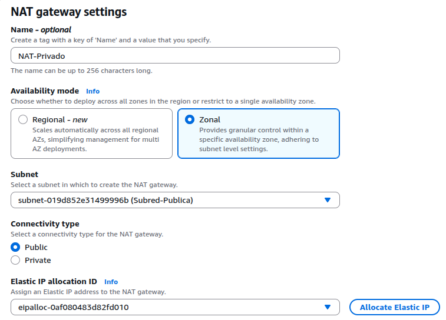
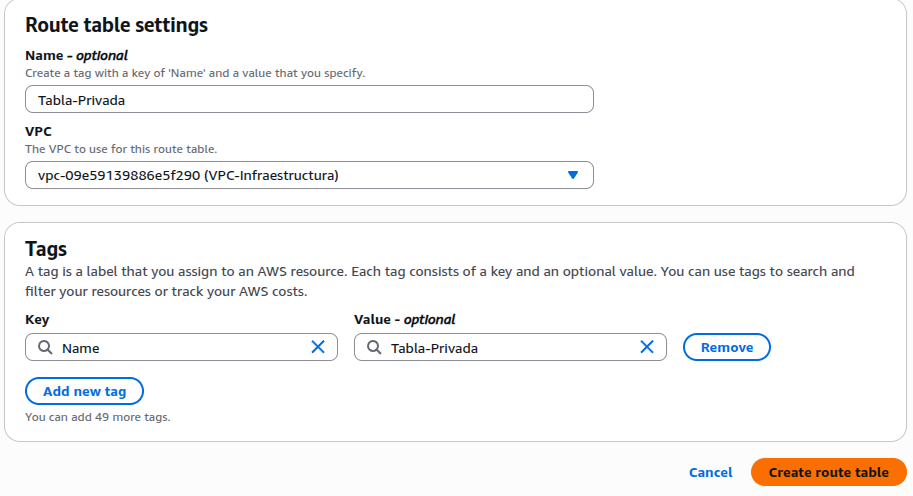
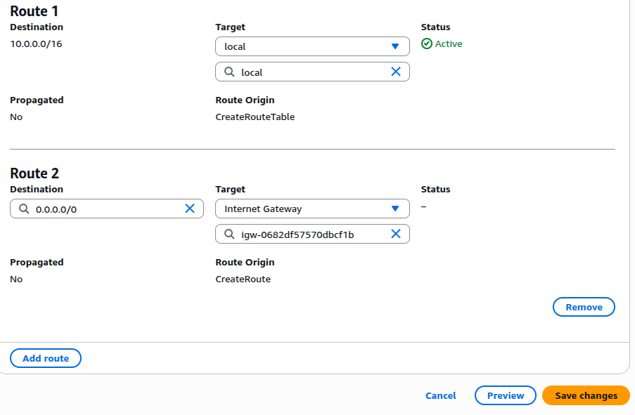
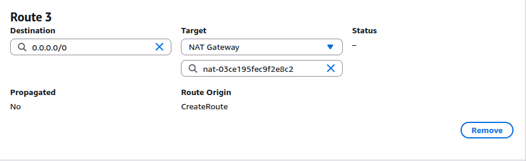

#### Servidors AWS
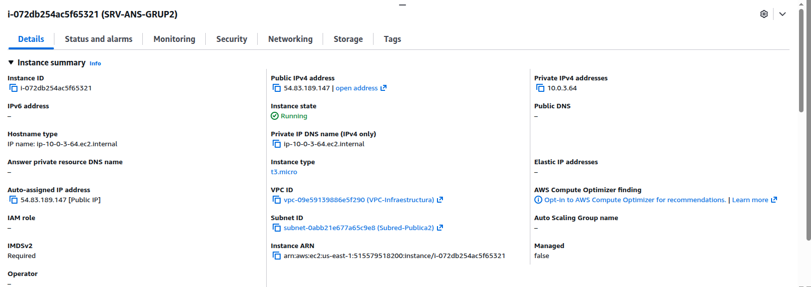
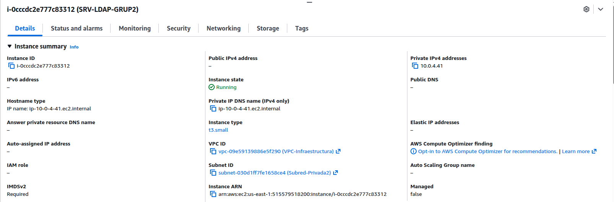

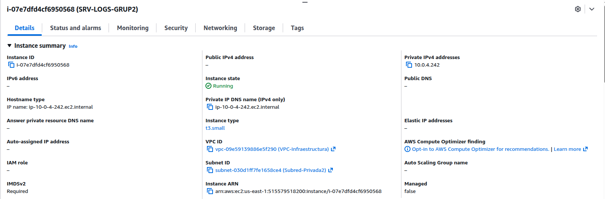

#### Web / SFTP — procés de creació
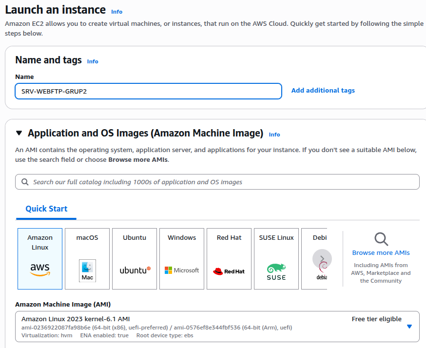
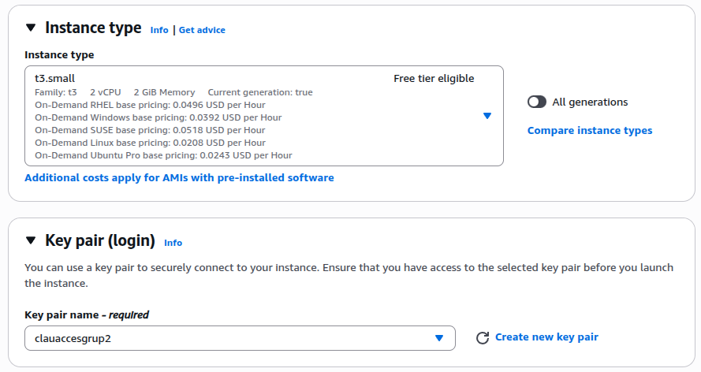
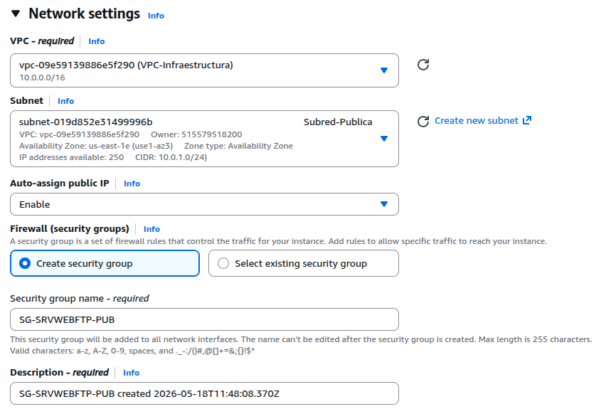
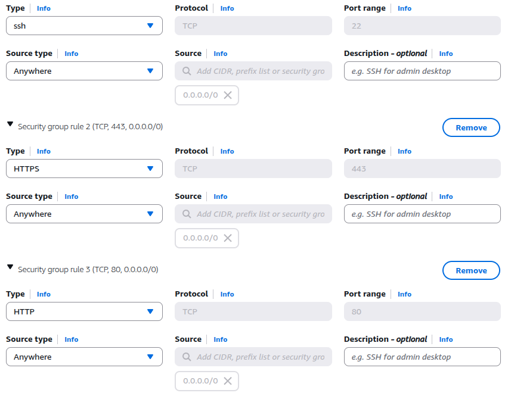

Referència: [02-aws](02-aws)

---

## 03. Àudio

### 3.1 03-audio/Descripció_de_la_funcionalitat_Audio.md

# Servei d'Àudio

## Descripció de la funcionalitat

El servei d’àudio implementat permet la distribució de contingut multimèdia en temps real mitjançant tecnologia de streaming,
aquest sistema facilita la transmissió d’àudio tant en directe com sota demanda a múltiples clients simultàniament a través de la xarxa.

Per a la implementació s’utilitza un servidor Icecast2, que actua com a servidor central de distribució d’àudio. 
Els clients poden accedir al contingut utilitzant navegadors web o reproductors multimèdia compatibles com VLC Media Player.

El servei és compatible amb formats digitals d’àudio com:

- MP3
- AAC
- OGG

## Funcionalitats principals

- Distribució d’àudio en *streaming* en temps real.
- Accés simultani de múltiples usuaris.
- Compatibilitat amb navegadors web.
- Reproducció remota mitjançant reproductors multimèdia.
- Gestió de canals d’àudio.

## Objectiu del servei

Aquest sistema permet millorar la comunicació interna de l’empresa i facilitar la distribució de contingut multimèdia als clients de forma eficient i escalable.

## Paquets utilitzats

### Servidor

sudo apt install icecast2


### Client multimèdia

sudo apt install vlc

---

## 04. Vídeo

### 4.1 04-video/Descripció_de_la_funcionalitat_Servei_de_Vídeo.md

# Servei de Vídeo

## Descripció de la funcionalitat

El servei de vídeo implementat permet la distribució de contingut audiovisual en streaming mitjançant protocols de transmissió multimèdia adaptats a entorns web i xarxes corporatives.

Per a la implementació s’utilitza un servidor NGINX amb el mòdul RTMP, encarregat de gestionar la recepció i distribució dels fluxos de vídeo, 
El sistema permet transmetre contingut en directe i oferir accés als vídeos des de navegadors web i clients multimèdia.

El servei utilitza:

- Protocol RTMP per a l’enviament del flux de vídeo.
- Protocol HLS per a la reproducció web.
- Còdec H.264 per a la compressió de vídeo.
- Format MP4 per a l’emmagatzematge i compatibilitat.

## Funcionalitats principals

- Streaming de vídeo en temps real.
- Accés remot des de navegador web.
- Compatibilitat amb diferents dispositius i clients.
- Distribució eficient del contingut multimèdia.
- Possibilitat de múltiples connexions simultànies.

## Objectiu del servei

Aquest sistema permet donar suport a la comunicació corporativa, la formació interna i la distribució de continguts audiovisuals als clients de l’empresa.

## Paquets utilitzats

### Servidor de vídeo

sudo apt install nginx
sudo apt install libnginx-mod-rtmp
sudo apt install ffmpeg


### Client de reproducció

sudo apt install vlc

---

## 05. Videoconferència

### 5.1 05-videoconferencia/Descripció_Protocol_WebRTC.md

# Protocol WebRTC

## Descripció

WebRTC (Web Real-Time Communication) és una tecnologia de comunicació en temps real que permet establir connexions d’àudio, 
vídeo i intercanvi de dades directament entre navegadors web i dispositius sense necessitat d’instal·lar programari addicional.

Aquest protocol és utilitzat en aplicacions de videoconferència com Jitsi Meet, permetent comunicacions segures i amb baixa latència.

## Característiques principals

- Comunicació en temps real entre usuaris.
- Transmissió d’àudio i vídeo amb baixa latència.
- Compatibilitat amb navegadors moderns.
- Connexions xifrades i segures mitjançant DTLS i SRTP.
- Comunicació peer-to-peer (P2P).
- Compartició de pantalla i dades.

## Funcionament

El funcionament de WebRTC es basa en tres fases principals:

1. Intercanvi d’informació entre clients.
2. Establiment de la connexió directa.
3. Transmissió dels fluxos multimèdia.

## Objectiu del protocol

Aquesta tecnologia és especialment adequada per a sistemes de videoconferència empresarials, ja que permet comunicacions eficients, segures i accessibles des de qualsevol navegador modern.

## Paquets utilitzats

### Plataforma de videoconferència

sudo apt install jitsi-meet


### Dependències principals

sudo apt install openjdk-17-jre-headless
sudo apt install nginx

---

## 06. Amplada de banda

La mesura d'amplada de banda s'implementa directament a l'aplicació web (`index.php`). Vegeu la secció **09** per a la documentació completa del sistema de mesura.

**Resum del funcionament:**
- L'administrador llança la mesura des del panell web (secció "📶 Amplada de banda").
- El servidor executa `runMesuraBanda()` en segon pla (via `fastcgi_finish_request` o procés CLI).
- S'intenta primer amb `speedtest-cli --simple`; si no està disponible, es fa servir `curl` contra el servidor de streaming (`23.23.53.151`).
- Es mesuren baixada (Mbps), pujada (Mbps) i latència + jitter (ms) contra el servidor de streaming.
- Criteris d'acceptabilitat: baixada ≥ 50 Mbps, pujada ≥ 10 Mbps, latència ≤ 150 ms.
- Els resultats es guarden a la taula `MESURA_AMPLADA_BANDA`.

També hi ha el script autònom `scripts/bandwidth_test.sh` que fa la mesura via `speedtest-cli` i inserta directament a la BD amb l'usuari MySQL `integracio`.

## 07. Base de dades

### 7.0 Visió general de la base de dades

La base de dades **InnovateTech** ha estat dissenyada i implementada per cobrir els
requisits dels apartats 3.2 i 3.3 de l'enunciat. Consta de **12 taules** que gestionen
el personal, les comunicacions (trucades, streaming), la monitorització de l'amplada
de banda i la seguretat/auditoria. El SGBD triat és **MariaDB 10.5** (completament
compatible amb MySQL), executat sobre una instància EC2 d'AWS Linux per evitar costos
addicionals.

Tots els scripts i captures es troben a la carpeta `capturas/07-bd/`. A continuació es
detallen els diferents blocs documentals que cobreixen cada check de la rúbrica.

> **Ordre de desplegament dels scripts**
> ```bash
> mysql -u root -p < InnovateTech.sql
> mysql -u root -p InnovateTech < triggers.sql
> mysql -u root -p InnovateTech < backup-event.sql
> ```
> Nota: la columna `adreça` (amb `ç`) requereix que la connexió sigui `utf8mb4`.
> L'script `InnovateTech.sql` ja comença amb `SET NAMES utf8mb4;` perquè la càrrega
> no falli amb cap client.

---

### 7.1 07-bd/backup-event.md

#### 7.1.1 Activació del planificador d'events

**Comandament:**
```sql
SHOW VARIABLES LIKE 'event_scheduler';
```

Resultat esperat: `Value = ON`. Si està desactivat, activar amb `SET GLOBAL event_scheduler = ON;`.


---

#### 7.1.2 Creació de l'event `backup_setmanal`

**Comandament (definició completa):**
```sql
SHOW CREATE EVENT backup_setmanal\G
```


---

#### 7.1.3 Verificació dels fitxers CSV generats

**Comandament (des de la terminal del sistema):**
```bash
ls -la /tmp/backup_*.csv
```


---

#### 7.1.4 Registre a la taula `CONTROL_BACKUP`

**Comandament:**
```sql
SELECT * FROM CONTROL_BACKUP ORDER BY id_backup DESC LIMIT 1\G
```


---

### 7.2 07-bd/er-diagrama.md

**Comandament** (per obtenir el diagrama): des del MySQL Workbench,
`Database → Reverse Engineer...` sobre l'esquema `InnovateTech`.


El procés detallat es descriu als subapartats següents.

---

#### 7.2.1 Extracció de requisits

Vam llegir l'enunciat (apartats 3.2 i 3.3) i vam identificar 12 entitats amb els
seus atributs, claus primàries i obligatorietat (`NOT NULL`). També vam detectar totes
les relacions i els seus tipus (1:N, N:M, 0..1:1).

#### 7.2.2 Disseny lògic

Vam dibuixar un esborrany inicial on vam assignar PK i FK, vam resoldre la relació N:M
entre `USUARI` i `ROL` amb la taula associativa `USUARI_ROL`, i vam establir
cardinalitats explícites (p. ex. `EMPLEAT → DEPARTAMENT` és N:1; `USUARI → EMPLEAT` és
0..1 : 1).

#### 7.2.3 Implementació al SGBD (MySQL)

Vam escriure un script SQL (`InnovateTech.sql`) que crea totes les taules amb
`PRIMARY KEY`, `FOREIGN KEY`, `NOT NULL`, `UNIQUE`, `CHECK` i dades de prova.

#### 7.2.4 Generació automàtica del diagrama

Vam executar l'script i vam usar l'eina *Reverse Engineer* del MySQL Workbench, que
llegeix l'esquema real i dibuixa automàticament taules, atributs i claus.

#### 7.2.5 Ajust manual i exportació

Vam reorganitzar la disposició de les taules per a una millor llegibilitat i vam
exportar el diagrama a PNG.


---

### 7.3 07-bd/model-relacional.md

#### 7.3.1 Obtenció de les sentències `CREATE TABLE`

**Comandament per a una taula representativa:**
```sql
SHOW CREATE TABLE USUARI\G
```


---

#### 7.3.2 Comprovació de claus foranes i `CHECK`

**Comandament per a la taula `TRUCADA`:**
```sql
SHOW CREATE TABLE TRUCADA\G
```


---

#### 7.3.3 Verificació de columnes `NOT NULL` / `NULL`

**Comandament:**
```sql
DESCRIBE USUARI;
```


---

#### 7.3.4 Comprovació de la restricció `UNIQUE` (email)

**Comandament que provoca l'error:**
```sql
INSERT INTO USUARI (nom_complet, email, estat, tipus)
VALUES ('Test', 'joan.garcia@innovatech.com', 'actiu', 'intern');
```

Resultat: `ERROR 1062 (23000): Duplicate entry 'joan.garcia@innovatech.com' for key 'email'.`


---

#### 7.3.5 Comprovació de la restricció `CHECK` (puntuació entre 1 i 5)

**Comandament que provoca l'error:**
```sql
INSERT INTO TRUCADA (usuari_originador, usuari_destinatari, data_inici, id_grup_qualitat, puntuacio)
VALUES (1, 2, NOW(), 1, 10);
```

Resultat: `ERROR 4025 (23000): CONSTRAINT chk_puntuacio failed for InnovateTech.TRUCADA.`


---

#### 7.3.6 Dades de prova significatives

**Comandament per a cada taula:**
```sql
SELECT * FROM DEPARTAMENT;
SELECT * FROM EMPLEAT;
SELECT * FROM USUARI;
SELECT * FROM TRUCADA;
SELECT * FROM VIDEO;
```

| Taula | Captura |
|---|---|
| DEPARTAMENT |  |
| EMPLEAT |  |
| USUARI |  |
| TRUCADA |  |
| VIDEO |  |

---

### 7.4 07-bd/rols-permisos.md

#### 7.4.1 Visualització dels rols i permisos d'admin

**Comandament:**
```sql
SHOW GRANTS FOR 'admin'@'%';
```


---

#### 7.4.2 Comprovació dels permisos d'un usuari amb rol `vendes`

**Comandament (executat com a usuari `vendes`):**
```sql
SHOW GRANTS;
```


---

#### 7.4.3 Execució de l'script `crear_usuari.sh`

**Comandament (des de terminal):**
```bash
./crear_usuari.sh
```


---

#### 7.4.4 Contingut del fitxer `.sql` generat

**Comandament:**
```bash
cat jair_grant.sql
```


---

#### 7.4.5 Presència de `GRANT FILE` al script generat


---

#### 7.4.6 Gestió d'errors de l'script

| Error | Captura |
|---|---|
| Nom d'usuari buit |  |
| Rol invàlid |  |
| Usuari root prohibit |  |
| Contrasenyes diferents |  |

---

### 7.5 07-bd/triggers.md

> **Nota tècnica:** la taula `AVIS` és `MyISAM` (no transaccional). Així els avisos
> que insereixen els triggers persisteixen malgrat el `ROLLBACK` que provoca el
> `SIGNAL SQLSTATE '45000'` en rebutjar l'operació.

---

#### 7.5.1 Trigger `check_minuts_mensuals` (quota 500 minuts/mes)

**Comandament que provoca l'error:**
```sql
INSERT INTO TRUCADA (usuari_originador, usuari_destinatari, data_inici, data_fi, durada_total, id_grup_qualitat)
VALUES (1, 2, NOW(), DATE_ADD(NOW(), INTERVAL 600 MINUTE), 36000, 1);
```

Resultat: `ERROR 1644 (45000): Has superat els 500 minuts aquest mes.`


**Comandament per veure l'avís registrat:**
```sql
SELECT * FROM AVIS WHERE detall LIKE '%minuts%' ORDER BY data_hora DESC LIMIT 1\G
```


---

#### 7.5.2 Trigger `check_trucades_diaries` (màxim 10 trucades/dia)

**Comandament que provoca l'error (després d'inserir 10 trucades):**
```sql
INSERT INTO TRUCADA (usuari_originador, usuari_destinatari, data_inici, data_fi, durada_total, id_grup_qualitat)
VALUES (1, 2, NOW(), DATE_ADD(NOW(), INTERVAL 1 MINUTE), 60, 1);
```

Resultat: `ERROR 1644 (45000): Ja has fet 10 trucades avui.`


**Avís a `AVIS`:**
```sql
SELECT * FROM AVIS WHERE detall LIKE '%diàries%' ORDER BY data_hora DESC LIMIT 1\G
```


---

#### 7.5.3 Trigger `check_usuari_bloquejat` (bloqueig d'usuaris)

**Bloquejar l'usuari:**
```sql
UPDATE USUARI SET estat = 'bloquejat' WHERE id_usuari = 5;
```


**Intent de trucada amb usuari bloquejat:**
```sql
INSERT INTO TRUCADA (usuari_originador, usuari_destinatari, data_inici, data_fi, durada_total, id_grup_qualitat)
VALUES (5, 1, NOW(), DATE_ADD(NOW(), INTERVAL 5 MINUTE), 300, 1);
```

Resultat: `ERROR 1644 (45000): Usuari bloquejat. No pot fer trucades..`


**Avís a `AVIS`:**
```sql
SELECT * FROM AVIS WHERE detall LIKE '%bloquejat%' ORDER BY data_hora DESC LIMIT 1\G
```


---

#### 7.5.4 Trigger d'auditoria `audit_treballador_update_empleat`

**Connexió com a usuari `treballador` i intent de modificació:**
```sql
UPDATE EMPLEAT SET nom = 'X' WHERE dni = '12345678A';
```


**Registre a `AVIS`:**
```sql
SELECT * FROM AVIS WHERE taula_afectada='EMPLEAT' AND operacio_intentada='UPDATE' ORDER BY data_hora DESC LIMIT 1\G
```


---

#### 7.5.5 Estructura de la taula `AVIS`

**Comandament:**
```sql
DESCRIBE AVIS;
```


---

### 7.6 Resum de compliance (checks superats)

| Check | Document | Captura clau |
|---|---|---|
| Diagrama E/R complet i cardinalitzat | er-diagrama.md | diagrama_ER.png / RAPJ-E-R.png |
| Model relacional amb PK, FK | model-relacional.md | show_create_table_usuari.png, show_create_table_trucada.png |
| BD amb PK, FK, NOT NULL, UNIQUE, CHECK | model-relacional.md | check_restrictions_usuari.png, check_unique_email.png, check_puntuacio_range.png |
| Dades de prova | model-relacional.md | select_departament.png, select_empleat.png, select_usuari.png, select_trucada.png, select_video.png |
| 4 rols creats amb permisos | rols-permisos.md | show_grants_admin.png, comprovacio_permisos_vendes.png |
| Script de creació d'usuaris funcional | rols-permisos.md | crear_usuari_execucions.png, crear_usuari_ok.png |
| Script genera .sql amb CREATE USER + GRANT | rols-permisos.md | contingut_sql_generat.png |
| Script inclou GRANT FILE | rols-permisos.md | grant_file_al_script.png |
| Script gestiona errors | rols-permisos.md | error_arguments.png, error_rol_invalid.png, error_usuari_existent.png, error_contrasenyes.png |
| Trigger quota minuts mensuals | triggers.md | error_quota_minuts.png, avis_quota_minuts.png |
| Trigger quota trucades diàries | triggers.md | error_quota_diaria.png, avis_quota_diaria.png |
| Taula d'avisos i triggers d'auditoria | triggers.md | error_auditoria_treballador.png, avis_auditoria.png, estructura_taula_avis.png |
| Trigger de bloqueig d'usuaris | triggers.md | bloquejar_usuari.png, error_usuari_bloquejat.png, avis_bloqueig.png |
| Event periòdic de backup | backup-event.md | event_scheduler_on.png, creacio_event.png, fitxers_csv_backup.png, control_backup_registre.png |

> Tots els elements estan implementats i documentats a la base de dades **InnovateTech**.

## 08. 1665

### 8.1 08-1665/ra3-optimitzacio.md

*Documento vacío.*

### 8.2 08-1665/ra5-seguretat-dades.md

*Documento vacío.*

### 8.3 08-1665/ra6-transformacio-digital.md

*Documento vacío.*

---

## 09. App Web

### 9.1 web/index.php — Panel de gestió CPD

Panel de gestión CPD de InnovateTech. Archivo único (`index.php`) que contiene el backend en PHP, los estilos CSS y el frontend en JavaScript (arquitectura SPA).

---

#### Arquitectura general

```
index.php
├── PHP (backend)          Líneas 1–341
│   ├── Constantes y configuración
│   ├── Modo CLI (fallback de medición)
│   ├── Sesión y helpers de BD
│   ├── Control de acceso por roles
│   ├── runMesuraBanda()
│   └── Router de acciones POST (API interna)
│
├── HTML + CSS             Líneas 342–530
│   ├── Variables de diseño (:root)
│   ├── Estilos de todos los componentes
│   ├── Pantalla de login
│   ├── Layout principal (sidebar + main)
│   └── Modales (edición, vista, vídeo, valoración, nueva llamada)
│
└── JavaScript (frontend)  Líneas 640–1350
    ├── Estado global
    ├── Ringtone y polling de llamadas entrantes
    ├── Login / Logout
    ├── Sidebar con emojis por sección
    ├── Dashboard
    ├── Videoconferencia (Jitsi)
    ├── Historial de llamadas
    ├── Catálogo de vídeo (HLS/MP4/iframe)
    ├── Amplada de banda
    ├── Avisos / Auditoría
    ├── Bloqueig d'usuaris
    ├── Backups
    ├── CRUD genérico de tablas
    └── Utilidades (toast, formateo, post())
```

---

#### 9.1.1 PHP — Backend

**Constantes de configuración**

| Constante | Valor | Descripción |
|---|---|---|
| `DB_HOST` | `32.197.67.184` | IP del servidor MySQL |
| `DB_USER` | `webadmin` | Usuario de la base de datos |
| `DB_PASS` | `pirineus` | Contraseña de la base de datos |
| `DB_NAME` | `InnovateTech` | Nombre de la base de datos |
| `JITSI_HOST` | `3.234.196.49` | Servidor Jitsi Meet para videoconferencias |
| `STREAMING_HOST` | `23.23.53.151` | Servidor de streaming/vídeo (objetivo de las mediciones) |

**Modo CLI** — Si el archivo se ejecuta con `php index.php mesura <uid>`, entra en modo CLI: conecta a la BD y llama directamente a `runMesuraBanda()`. Se usa como fallback cuando `fastcgi_finish_request()` no está disponible.

**Helpers de BD:**
- `getDB()` — Abre conexión MySQLi, muere con JSON de error si falla.
- `dbq($db, $sql)` / `dbrow($db, $sql)` — Wrappers de query y fetch.

**Control de acceso por roles (`$ROL_PERMISOS`):**

| Rol | Tablas accesibles | Solo lectura |
|---|---|---|
| `admin` | Todas (13 tablas) | Ninguna |
| `vendes` | TRUCADA, USUARI, VIDEO | USUARI, VIDEO |
| `administracio` | EMPLEAT, DEPARTAMENT, USUARI, USUARI_ROL | Ninguna |
| `treballador` | VIDEO, TRUCADA | VIDEO, TRUCADA |

**`addAvis()`** — Registra eventos de auditoría en `AVIS` cuando un usuario intenta una operación no permitida.

**`runMesuraBanda()`** — Medición de ancho de banda en segundo plano:
- *Método 1 (preferente)*: `speedtest-cli --simple` → parsea Ping/Download/Upload.
- *Método 2 fallback*: curl para bajada (streaming server → Cloudflare), POST para subida (httpbin → Cloudflare → TCP raw 5s).
- Latencia + jitter: 6 conexiones TCP a `STREAMING_HOST:80`, descarta extremos, calcula media y desviación estándar.
- Criterio: bajada ≥ 50 Mbps, subida ≥ 10 Mbps, latencia ≤ 150 ms → `acceptable`.

**Router de acciones POST** — Todas las peticiones llegan como `POST action=...` y responden en JSON:

| Action | Auth | Descripción |
|---|---|---|
| `login` | No | Valida email+contrasenya, crea sesión. Bloquea `extern`. |
| `logout` | Sí | Destruye la sesión. |
| `tables` | Sí | Tablas permitidas para el rol actual. |
| `dashboard_stats` | Sí | Estadísticas por rol. |
| `trucades` | Sí | Historial de llamadas (treballador: solo las suyas; administracio: denegado + audit). |
| `iniciar_trucada` | Sí | Registra inicio en `TRUCADA`, valida estado del destinatario. |
| `finalitzar_trucada` | Sí | Rellena `data_fi` y `durada_total`. |
| `trucada_entrant` | Sí | Polling: devuelve llamada entrante activa en los últimos 5 min. |
| `valorar_trucada` | Sí | Guarda puntuación 1–5 y comentario. |
| `usuaris_llista` | Sí | Usuarios activos para llamar (treballador: solo internos). |
| `videos` | Sí | Catálogo con búsqueda por título/categoría/descripción. |
| `canals_audio` | Sí | Parámetros de `CONFIGURACIO_SERVIDOR` con prefijo `audio_`. |
| `usuaris_gestio` | Admin | Lista todos los usuarios con rol y estado. |
| `bloquejar_usuari` | Admin | Cambia estado a `bloquejat` + registra en `AVIS`. |
| `desbloquejar_usuari` | Admin | Cambia estado a `actiu`. |
| `executar_mesura_banda` | SuperAdmin | Lanza `runMesuraBanda()` en background. |
| `mesures_banda` | SuperAdmin | Últimas 100 mediciones. |
| `avisos_log` | SuperAdmin | Todos los registros de `AVIS`. |
| `backups_log` | SuperAdmin | Todos los registros de `CONTROL_BACKUP`. |
| `read` | Por rol | Lee tabla con búsqueda full-text, máx. 200 filas. |
| `insert` / `update` / `delete` | Por rol (no readonly) | CRUD genérico. |

---

#### 9.1.2 HTML + CSS

**Paleta de colores (variables CSS `:root`):**

| Variable | Color | Uso |
|---|---|---|
| `--bg` | `#0a0a0f` | Fondo principal |
| `--bg2` | `#111118` | Tarjetas y sidebar |
| `--bg3` | `#1a1a24` | Inputs y cabeceras |
| `--accent` | `#6c63ff` | Morado (botones, activos) |
| `--accent2` | `#ff6584` | Rosa (degradados, alertas) |
| `--success` | `#43e8b0` | Verde (éxito) |
| `--font` | Syne | Tipografía principal |
| `--mono` | DM Mono | Tipografía monospace |

**Estructura HTML:**
```
#login-screen          Pantalla de login (oculta tras login)
#app
  aside.sidebar        Fijo 300px, secciones con emojis
  main.main            Área de contenido dinámica (SPA)
#modal                 CRUD edición
#view-modal            CRUD visualización
#video-modal           Reproductor de vídeo
#rating-modal          Valoración 1–5 estrellas
#newcall-modal         Selección de usuario para llamar
#incoming-banner       Banner llamada entrante (fixed, top)
#toast                 Notificación flotante
```

---

#### 9.1.3 JavaScript — Frontend

**Sidebar con emojis:**

| Sección | Items |
|---|---|
| General | 🏠 Dashboard · 📹 Videoconferència · 📞 Historial · 🎬 Catàleg |
| Administració | 🔒 Bloqueig · 📶 Amplada · 🔔 Avisos · 💾 Backups |
| Base de dades | 🏢 DEPARTAMENT · 👤 EMPLEAT · 👥 USUARI · 🎭 ROL · 🔑 USUARI_ROL · ✅ GRUP_QUALITAT · 📞 TRUCADA · 🎬 VIDEO · 📶 MESURA_AMPLADA_BANDA · ⚙️ CONFIGURACIO_SERVIDOR · 🔔 AVIS · 💾 CONTROL_BACKUP · 🔐 CONTRASENYES |

**Login:** el campo de email tiene sufijo visual `@innovatech.com`. Si el usuario no escribe `@`, se añade automáticamente en `doLogin()`.

**Polling de llamadas:** `setInterval` cada 4 segundos → `trucada_entrant`. Si hay llamada, muestra banner con ringtone (MP3 o Web Audio API sintético). El receptor puede aceptar (abre Jitsi) o declinar (finaliza la llamada).

**Videoconferència (Jitsi):** lazy-loading del script `external_api.js`. Sala nombrada `InnovateTech-Call-{id}`. Al cerrar: finaliza llamada en BD + abre modal de valoración. Para clientes externos: barra con enlace copiable.

**Catàleg de vídeo:** `catEmoji(cat)` mapea categoría → emoji (📚 formació, 💼 vendes, 💻 tecnologia, 🔒 seguretat, etc.). Reproductor con soporte HLS (`hls.js`), MP4 nativo e iframe.

**Amplada de banda:** botón "Executar mesura" → contador regresivo 60s → recarga automática de la tabla.

**CRUD genérico:** funciona para cualquier tabla permitida. URLs en celdas se convierten en enlaces clicables automáticamente.

**Utilidades:**
- `post(data)` — `fetch POST` al mismo archivo, responde JSON.
- `toast(msg, type)` — Notificación flotante 3 segundos.
- `fmtDate(d)` — Fecha en formato catalán `dd/mm/yyyy hh:mm`.
- `fmtDur(s)` — Segundos → `Xm Ys`.

---

#### 9.1.4 Tablas de la BD utilizadas por la app

| Tabla | Uso |
|---|---|
| `USUARI` | Autenticación, listado, bloqueo |
| `CONTRASENYES` | Hash de contraseña activa |
| `USUARI_ROL` | Rol asignado a cada usuario |
| `ROL` | Definición de roles |
| `EMPLEAT` | CRUD de empleados |
| `DEPARTAMENT` | CRUD de departamentos |
| `TRUCADA` | Registro completo de llamadas |
| `GRUP_QUALITAT` | Grupo de calidad de cada llamada |
| `VIDEO` | Catálogo de vídeos |
| `MESURA_AMPLADA_BANDA` | Historial de mediciones de red |
| `CONFIGURACIO_SERVIDOR` | Parámetros del servidor (audio, etc.) |
| `AVIS` | Log de auditoría |
| `CONTROL_BACKUP` | Historial de backups |

---
